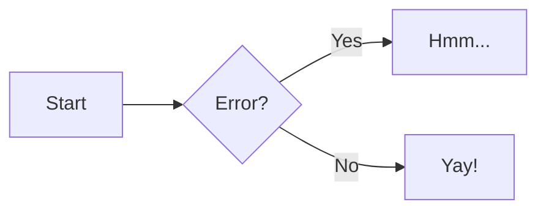

# Bartleby — Python Static Site Generator Specification

## Overview

Bartleby is a Python static site generator inspired by Hugo's power and flexibility, with MkDocs's simplicity and the Material theme built in. Named after Melville's scrivener, Bartleby combines the best ideas from Hugo (template lookup, shortcodes, taxonomies, content types) and MkDocs (YAML-driven nav, simple config, great defaults) into a single Python tool.

Unlike MkDocs + mkdocs-material (two separate projects), Bartleby ships the Material theme as its default and only built-in theme. The Material design is ported from the open-source mkdocs-material project (MIT licensed) using a hybrid approach: CSS/JS carried over largely as-is, Jinja2 templates rewritten to fit Bartleby's architecture.

## Motivation

- mkdocs-material's move toward Zensical introduces uncertainty for users who depend on the current open-source theme
- MkDocs's blog/tutorial plugin system feels limiting — custom metadata, taxonomy control, and template flexibility are constrained
- Hugo has the right architecture but is written in Go; the Python ecosystem (PyTexas, do-markdown, pymdownx) needs a Python-native SSG with similar power
- Bartleby will serve both Mason Egger's personal site and PyTexas, with potential for broader adoption

## Design Principles

1. **Simple by default, powerful when you need it** — YAML config and sensible defaults get you running immediately. When you need customization, the escape hatches are clean and predictable.
2. **Material is the theme** — no theme marketplace, no separate theme package. Material is built in. Override templates and CSS if you want a different look.
3. **Batteries included** — search, RSS/Atom, sitemap, syntax highlighting, do-markdown, pymdownx extensions all ship out of the box.
4. **Build-time validation** — content type metadata schemas catch errors before deployment, not after.
5. **Plugin-friendly** — extend via pip packages or local Python files in a `plugins/` directory.

---

## Configuration

### File: `bartleby.yml`

The single configuration file for a Bartleby site. Modeled after `mkdocs.yml` but with additional power for content types and taxonomies.

```yaml
site:
  title: "Mason Egger"
  url: "https://masonegger.com"
  description: "Personal site of Mason Egger"
  author: "Mason Egger"

nav:
  - Home: index.md
  - Blog: blog/
  - Tutorials: tutorials/
  - Speaking: speaking/
  - About: about.md

# Omit nav entirely to auto-generate from directory structure.
# Auto-generated nav uses directory names as section titles and
# file titles (from front matter or filename) as page titles,
# sorted alphabetically.

theme:
  palette:
    primary: "#283618"
    accent: "#BC6C25"
    background: "#FEFAE0"
  features:
    - search
    - navigation.tabs
    - navigation.sections
    - content.code.copy
    - content.code.annotate
    - content.tooltips
  logo: static/logo.png
  favicon: static/favicon.ico
  font:
    text: Roboto
    code: Roboto Mono

authors_file: .authors.yml  # Default location for author definitions

content_types:
  blog:
    path: blog/posts
    url_format: "{date:%Y/%m/%d}/{slug}"  # Optional: default is path-based
    pagination:
      enabled: true
      per_page: 10
    taxonomies: [tags, categories]
    feeds: [rss, atom]
    readtime: true
    excerpt_separator: "<!-- more -->"
  tutorials:
    path: tutorials/posts
    pagination:
      enabled: true
      per_page: 10
    taxonomies: [tags, categories]
    feeds: [rss]
    readtime: true
    excerpt_separator: "<!-- more -->"
    metadata:
      last_verified:
        type: date
        required: true
      first_published:
        type: date
        required: true
      difficulty:
        type: string
        required: false
        choices: [beginner, intermediate, advanced]
  speaking:
    path: speaking/posts
    pagination:
      enabled: false
    taxonomies: [tags]
    feeds: [rss]

taxonomies:
  tags:
    slug_format: "tag:{slug}"   # URL slug format
  categories:
    slug_format: "category:{slug}"

exclude_patterns:
  - "_drafts/**"
  - "_*.md"
  - ".git/**"

markdown_extensions:
  - pymdownx.superfences:
      custom_fences:
        - name: mermaid
          class: mermaid
  - do_markdown.fence:
      allowed_environments: []

plugins:
  - search
  - rss

dev_server:
  host: "127.0.0.1"
  port: 8000
```

### Configuration Sections

- **site**: Global site metadata (title, URL, description, author).
- **nav**: MkDocs-style navigation definition. Ordered list of nav items. Supports nesting. Omit to auto-generate from directory structure.
- **theme**: Material theme configuration (palette, features, logo, favicon, fonts). Controls Material's built-in features.
- **authors_file**: Path to the authors definition file (default: `.authors.yml`).
- **content_types**: Define content sections with their own paths, URL formats, pagination, taxonomy, feed generation, read time, excerpts, and metadata schemas.
- **taxonomies**: Site-wide taxonomy definitions with slugification options. Content types opt in via their `taxonomies` list.
- **exclude_patterns**: Gitignore-style patterns to exclude files from content discovery.
- **markdown_extensions**: Configure Python-Markdown extension options. All default extensions (do-markdown, pymdownx, standard) are loaded automatically — this section is for overriding their configuration or adding new extensions.
- **plugins**: List of enabled plugins. Pip-installed packages and local `plugins/` files are both valid.
- **dev_server**: Development server configuration (host, port).

### Config Validation

Bartleby validates `bartleby.yml` at load time:

- Required fields: `site.title`, `site.url`
- Content type paths must exist under `content/`
- Taxonomy names referenced in content types must be defined in `taxonomies`
- Markdown extension names must be importable
- Plugin names must be discoverable (entry points or `plugins/` directory)
- Invalid config produces clear error messages with the offending key path

---

## Authors

### Author Definitions

Authors are defined in a YAML file (default: `.authors.yml` at project root), following mkdocs-material's convention:

```yaml
authors:
  mason:
    name: Mason Egger
    description: "Developer Advocate & Python enthusiast"
    avatar: https://avatars.githubusercontent.com/u/...
    url: https://masonegger.com
  guest:
    name: Guest Author
    description: "Community contributor"
```

### Usage in Content

Reference authors by key in front matter:

```yaml
---
title: "My Post"
authors:
  - mason
  - guest
---
```

### Author Data in Templates

Templates receive resolved author objects (not just keys):

```jinja2

  
  <a href="{{ author.url }}">{{ author.name }}</a>

```

### Validation

- Author keys referenced in front matter must exist in the authors file
- Missing author keys produce a build error with the offending file path and key

---

## Content Organization

### Directory Structure

```
my-site/
├── bartleby.yml
├── .authors.yml            # Author definitions
├── content/
│   ├── index.md
│   ├── about.md
│   ├── blog/
│   │   ├── index.md        # Optional: content displayed above post listing
│   │   └── posts/
│   │       ├── 001-first-post.md
│   │       └── 002-second-post.md
│   ├── tutorials/
│   │   ├── index.md        # Optional: content displayed above tutorial listing
│   │   └── posts/
│   │       └── deploy-with-temporal.md
│   └── speaking/
│       ├── index.md        # Optional: content displayed above talks listing
│       ├── posts/
│       │   └── pycon-2025.md
│       └── docs/
│           └── pycon-2025-slides.pdf
├── templates/               # User template overrides
├── plugins/                 # Local plugin files
├── static/                  # Static assets (images, etc.)
└── site/                    # Build output (generated)
```

### Listing Pages

Each content type automatically generates a listing page at its base URL (e.g., `/blog/`). The listing shows posts in reverse chronological order with excerpts, pagination, and metadata.

If a `content/{type}/index.md` file exists, its rendered content is displayed **above** the auto-generated post listing. This allows users to add introductory text, custom markup, or any content before the posts. If no `index.md` exists, the listing page renders with just the post listing.

### Front Matter

Every content file uses YAML front matter. Standard fields plus content-type-specific fields defined in `bartleby.yml`.

```yaml
---
title: "Deploy with Temporal"
description: "Learn how to deploy workflows with Temporal"
date: 2026-03-01
last_verified: 2026-03-10
first_published: 2024-06-15
difficulty: intermediate
draft: false
tags:
  - python
  - temporal
categories:
  - devops
template: custom-tutorial.html  # Optional: override template lookup
url: custom/path/to/page        # Optional: override URL (default is path-based)
authors:
  - mason
---
```

### Standard Front Matter Fields

These fields are recognized on all content:

| Field | Type | Description |
|-------|------|-------------|
| `title` | string | Page title (required) |
| `description` | string | Page description / meta description |
| `date` | date | Publication date |
| `draft` | bool | Exclude from production builds (default: `false`) |
| `template` | string | Override template lookup |
| `url` | string | Override the generated URL path |
| `authors` | list | Author keys from `.authors.yml` |
| `{taxonomy}` | list | Values for any configured taxonomy (e.g., `tags`, `categories`) |

### Content Features

- **Excerpts**: Use the configured separator (default `<!-- more -->`) to define post excerpts for listing pages. Content before the separator becomes the excerpt. If no separator is present and the content type has `excerpt_separator` configured, the first paragraph is used.
- **Drafts**: Set `draft: true` to exclude from production builds. Shown during `bartleby serve`.
- **Read time**: When `readtime: true` is set on a content type, Bartleby calculates estimated reading time and makes it available in templates as `page.readtime` (in minutes).
- **Custom metadata**: Content-type-specific fields defined in config, validated at build time.

### File Exclusion

Files matching `exclude_patterns` in config are ignored during content discovery. Patterns use gitignore syntax. Defaults:

```yaml
exclude_patterns:
  - "_drafts/**"
  - "_*.md"
  - ".git/**"
```

---

## URL Generation

### Default: Path-Based

By default, URLs mirror the content directory structure:

- `content/blog/posts/my-first-post.md` → `/blog/posts/my-first-post/`
- `content/about.md` → `/about/`

### Per-Content-Type URL Format

Content types can define a `url_format` string with placeholders:

```yaml
content_types:
  blog:
    url_format: "{date:%Y/%m/%d}/{slug}"
```

Available placeholders:

| Placeholder | Description | Example |
|-------------|-------------|---------|
| `{slug}` | Slugified filename (or front matter `slug` field) | `my-first-post` |
| `{date:%Y/%m/%d}` | Date with strftime format | `2026/03/01` |
| `{title}` | Slugified title | `deploy-with-temporal` |
| `{categories}` | First category (slugified) | `devops` |

The content type's base path is prepended: `blog` + `url_format` → `/blog/2026/03/01/my-first-post/`.

### Per-Page URL Override

Any page can override its URL with the `url` front matter field:

```yaml
---
url: custom/path/to/page
---
```

This produces an absolute path: `/custom/path/to/page/`.

---

## Build-Time Metadata Validation

When a content type defines a `metadata` schema in `bartleby.yml`, Bartleby validates every content file of that type at build time.

### Validation Rules

- **required: true** — build fails (or warns, configurable) if the field is missing
- **type: date** — value must parse as a valid date
- **type: string** — value must be a string
- **type: integer** — value must be an integer
- **type: boolean** — value must be a boolean
- **type: list** — value must be a list
- **choices: [...]** — value must be one of the listed options

### Validation Behavior

- Validation runs before rendering, so errors are caught early
- Missing required fields produce clear error messages with file paths
- Type mismatches produce clear error messages
- Invalid choice values list the valid options
- Configurable: strict mode (fail build) vs. warning mode (log and continue)

### Testable Components

- Schema parser: reads content type metadata definitions from config
- Validator: checks front matter against schema, returns structured errors
- Reporter: formats validation errors for CLI output

---

## Markdown Pipeline

### Engine: Python-Markdown

Bartleby uses Python-Markdown as its rendering engine. All extensions — do-markdown, pymdownx, and standard — are loaded by default as core functionality. Users never need to add them as plugins or list them in config. do-markdown is a first-class citizen; if a do-markdown extension is missing a needed feature, the fix goes upstream in do-markdown.

### Extension Loading Order

Extension processor ordering matters. Bartleby manages this internally to ensure correct behavior:

1. `pymdownx.superfences` (priority 25) — must run before do-markdown fence
2. `do_markdown.fence` (priority 40) — enhances code blocks after superfences processes them
3. `do_markdown.highlight` (priority 175 inline, 25 post) — text highlighting in code blocks
4. All other extensions in standard priority order

Users do not need to worry about ordering — Bartleby handles it.

### Default Extensions

**do-markdown extensions (first-class, loaded automatically):**
- `do_markdown.fence` — labels, secondary labels, environment tags, line numbers, command prefixes, custom prefixes
- `do_markdown.highlight` — inline text highlighting with `<^>` markers (primarily for use inside code blocks)
- `do_markdown.youtube` — YouTube embed blocks
- `do_markdown.codepen` — CodePen embed blocks
- `do_markdown.twitter` — Twitter/X embed blocks
- `do_markdown.instagram` — Instagram embed blocks
- `do_markdown.slideshow` — Image slideshow blocks
- `do_markdown.image_compare` — Before/after image comparison blocks

**PyMdown Extensions (pymdownx, loaded automatically):**
- `pymdownx.superfences` — enhanced fenced code blocks, custom fences (Mermaid)
- `pymdownx.highlight` — syntax highlighting with Pygments
- `pymdownx.inlinehilite` — inline code highlighting
- `pymdownx.tabbed` — content tabs
- `pymdownx.details` — collapsible details/summary blocks
- `pymdownx.tasklist` — GitHub-style task lists
- `pymdownx.arithmatex` — math notation (MathJax/KaTeX)
- `pymdownx.keys` — keyboard key rendering
- `pymdownx.mark` — text marking/highlighting with `==` syntax
- `pymdownx.caret` — superscript and insert with `^^` and `^`
- `pymdownx.tilde` — subscript and strikethrough with `~~` and `~`
- `pymdownx.critic` — critic markup for suggested changes
- `pymdownx.smartsymbols` — smart symbol replacement
- `pymdownx.emoji` — emoji and icon support
- `pymdownx.snippets` — file inclusion and glossary support
- `pymdownx.blocks.caption` — image/figure captions

**Standard Python-Markdown extensions (loaded automatically):**
- `tables` — data tables
- `toc` — table of contents generation
- `attr_list` — attribute lists for adding CSS classes, IDs, and attributes
- `def_list` — definition lists
- `footnotes` — footnote references and content
- `admonition` — callout/note boxes
- `abbr` — abbreviations and tooltips
- `md_in_html` — markdown inside HTML blocks

### Extension Configuration

Default extensions are always loaded. The `markdown_extensions` config section allows overriding their options or adding new extensions:

```yaml
markdown_extensions:
  # Override options for a default extension
  - pymdownx.superfences:
      custom_fences:
        - name: mermaid
          class: mermaid
  # Add a third-party extension
  - my_custom_extension:
      option: value
```

### Plugin-Controlled Extensions

Plugins can register additional Python-Markdown extensions via the `on_config` hook.

---

## Content Reference

This section documents all content formatting features available in markdown files. These features match mkdocs-material's reference syntax, with additional capabilities from do-markdown.

### Admonitions

Callout boxes for notes, warnings, tips, etc. Powered by `admonition` and `pymdownx.details`.

**Basic syntax:**

```markdown
!!! note
    This is a note admonition. Content must be indented by four spaces.

!!! warning "Custom Title"
    Warning with a custom title.

!!! tip ""
    Tip with no title (empty string removes the title).
```

**Supported types:** `note`, `abstract`, `info`, `tip`, `success`, `question`, `warning`, `failure`, `danger`, `bug`, `example`, `quote`

**Collapsible (details/summary):**

```markdown
??? tip "Click to expand"
    This content is hidden by default.

???+ warning "Expanded by default"
    The + makes it start open.
```

**Inline admonitions** (float beside text):

```markdown
!!! info inline end "Right-aligned"
    This floats to the right of the following text.

!!! info inline "Left-aligned"
    This floats to the left of the following text.
```

Inline admonitions must be declared *before* the content they float beside.

**Nested admonitions:**

```markdown
!!! note "Outer"
    Outer content.

    !!! warning "Inner"
        Nested admonition with additional indentation.
```

### Annotations

Numbered markers in content that expand to show additional information on click. Annotations require the `content.code.annotate` theme feature.

**In regular content:**

```markdown
Lorem ipsum dolor sit amet, (1) consectetur adipiscing elit.
{ .annotate }

1.  I'm an annotation! Supports `code`, **formatting**, images, etc.
```

The `(1)` marker appears inline; the numbered list below defines the annotation content.

**Nested annotations:**

```markdown
Text with (1) annotation.
{ .annotate }

1.  First annotation with (1) another annotation inside.
    { .annotate }

    1.  Nested annotation content.
```

**In admonitions:**

```markdown
!!! note annotate "Title with (1) annotation"

    Body text with (2) annotation.

1.  Title annotation content.
2.  Body annotation content.
```

**In content tabs:**

```markdown
=== "Tab 1"

    Text with (1) annotation.
    { .annotate }

    1.  Tab annotation content.
```

**In code blocks:**

````markdown
```yaml
theme:
  features:
    - content.code.annotate # (1)
```

1.  This is a code annotation.
````

Use `# (1)!` to strip the comment character from the rendered output.

### Code Blocks

Enhanced code blocks with titles, line numbers, highlighting, annotations, and copy buttons. Powered by `pymdownx.highlight`, `pymdownx.superfences`, and `do_markdown.fence`.

**Basic with language:**

````markdown
```python
print("hello world")
```
````

**With title** (mkdocs-material syntax):

````markdown
```python title="script.py"
print("hello world")
```
````

**With label** (do-markdown syntax — both syntaxes are supported):

````markdown
```python
[label script.py]
[secondary_label Output]
print("hello world")
```
````

Both `title="..."` and `[label ...]` produce a title on the code block. do-markdown's `[secondary_label]` adds a second label — useful for showing both filename and output type.

**Line numbers:**

````markdown
```python linenums="1"
def hello():
    print("hello")
```
````

**Highlight specific lines:**

````markdown
```python hl_lines="2 3"
def hello():
    print("hello")  # highlighted
    return True      # highlighted
```
````

Ranges also work: `hl_lines="3-5"`

**Inline token highlighting** (do-markdown — works inside code blocks):

````markdown
```python
print(<^>"highlighted text"<^>)
```
````

The `<^>` markers highlight specific tokens within a line, complementing the line-level `hl_lines` feature.

**Command prefixes** (do-markdown):

````markdown
```bash
[command]
ls -la
cd /tmp
```
````

Adds `$` prefixes to each line, indicating shell commands.

**Environment tags** (do-markdown):

````markdown
```python
[environment local]
python manage.py runserver
```
````

Adds an environment label to the code block.

**Code annotations:**

````markdown
```yaml
theme:
  features:
    - content.code.annotate # (1)
```

1.  This annotation explains the feature.
````

Use `# (1)!` to strip the comment syntax from the rendered code.

**Copy button:** Enabled globally via `content.code.copy` theme feature. Per-block control with `{ .copy }` or `{ .no-copy }`.

**Inline code highlighting:**

```markdown
The `#!python range()` function generates a sequence.
```

### Content Tabs

Tabbed content blocks for showing alternatives side-by-side. Powered by `pymdownx.tabbed`.

```markdown
=== "Python"

    ```python
    print("Hello")
    ```

=== "JavaScript"

    ```javascript
    console.log("Hello");
    ```
```

**Tabs in admonitions:**

```markdown
!!! example

    === "Unordered List"

        * Item one
        * Item two

    === "Ordered List"

        1. Item one
        2. Item two
```

**Linked tabs:** When `content.tabs.link` theme feature is enabled, clicking a tab label syncs all matching tab labels across the page.

### Data Tables

Standard markdown tables with optional sorting. Powered by `tables`.

```markdown
| Method   | Description          |
| -------- | -------------------- |
| `GET`    | Fetch resource       |
| `PUT`    | Update resource      |
| `DELETE` | Delete resource      |
```

**Column alignment** via colons in the separator row:

```markdown
| Left     | Center   | Right    |
| :------- | :------: | -------: |
| text     | text     | text     |
```

**Sortable tables** are enabled via theme JavaScript (tablesort.js).

### Diagrams

Mermaid diagrams rendered client-side. Powered by `pymdownx.superfences` with a custom fence.

````markdown

````

Supported diagram types: flowcharts, sequence diagrams, state diagrams, class diagrams, entity-relationship diagrams, and all other Mermaid diagram types.

Requires `pymdownx.superfences` configured with the mermaid custom fence (included in Bartleby's defaults).

### Footnotes

Reference-style footnotes. Powered by `footnotes`.

```markdown
Lorem ipsum[^1] dolor sit amet[^note].

[^1]: Single-line footnote content.

[^note]:
    Multi-line footnote content.
    Indent continuation lines by four spaces.
```

Footnotes are rendered at the bottom of the page with automatic backlinks. Identifiers can be numbers or names.

When the `content.footnote.tooltips` theme feature is enabled, footnotes display as inline tooltips on hover.

### Formatting

Text formatting beyond standard markdown. Powered by `pymdownx.mark`, `pymdownx.caret`, `pymdownx.tilde`, `pymdownx.critic`, and `pymdownx.keys`.

**Highlighting/marking:**

```markdown
==This text is highlighted==
```

Note: do-markdown's `<^>text<^>` syntax also produces `<mark>` tags and is supported, but `==text==` is the preferred syntax for prose. Reserve `<^>` for highlighting inside code blocks where `==` cannot reach.

**Subscript and superscript:**

```markdown
H~2~O (subscript)
A^T^A (superscript)
```

**Insert and delete:**

```markdown
^^This was inserted^^
~~This was deleted~~
```

**Keyboard keys:**

```markdown
++ctrl+alt+del++
++cmd+shift+p++
```

**Critic markup** (suggested changes):

```markdown
{--deleted text--}
{++added text++}
{~~old text~>new text~~}
{==highlighted text==}
{>>inline comment<<}
```

### Grids

Card layouts and grid arrangements. Powered by `attr_list` and `md_in_html`.

**Card grid (list syntax):**

```html
<div class="grid cards" markdown>

- :fontawesome-brands-python: __Python__ for backend logic
- :fontawesome-brands-js: __JavaScript__ for interactivity
- :fontawesome-brands-css3: __CSS__ for styling

</div>
```

**Cards with details:**

```html
<div class="grid cards" markdown>

-   :material-clock-fast:{ .lg .middle } __Set up in 5 minutes__

    ---

    Install and get running quickly.

    [:octicons-arrow-right-24: Getting started](#)

</div>
```

**Generic grid** (arrange any blocks side by side):

```html
<div class="grid" markdown>

=== "Tab 1"
    Content here

=== "Tab 2"
    Content here

</div>
```

### Icons and Emojis

Inline icons and emojis. Powered by `pymdownx.emoji`.

**Emojis:**

```markdown
:smile: :heart: :rocket:
```

**Icons** (Material Design, FontAwesome, Octicons, Simple Icons):

```markdown
:material-account-circle:
:fontawesome-brands-github:
:octicons-heart-fill-24:
```

**Icons with styling** (via `attr_list`):

```markdown
:fontawesome-brands-youtube:{ .youtube }
:octicons-heart-fill-24:{ .heart }
```

Custom CSS classes can add colors, animations, or sizing.

### Images

Enhanced image handling. Powered by `attr_list` and `md_in_html`.

**Alignment:**

```markdown
{ align=left }
{ align=right }
```

**With caption:**

```markdown
{ width="300" }
/// caption
Image caption text
///
```

Or using HTML figure:

```html
<figure markdown="span">
  { width="300" }
  <figcaption>Image caption</figcaption>
</figure>
```

**Lazy loading:**

```markdown
{ loading=lazy }
```

**Light/dark mode variants:**

```markdown


```

### Lists

Enhanced list features. Powered by `def_list` and `pymdownx.tasklist`.

**Definition lists:**

```markdown
`Term`
:   Definition of the term. Indent by four spaces.

`Another term`
:   Another definition.
```

**Task lists:**

```markdown
- [x] Completed task
- [ ] Incomplete task
    - [x] Nested completed subtask
    - [ ] Nested incomplete subtask
```

### Math

Mathematical notation. Powered by `pymdownx.arithmatex` with MathJax or KaTeX.

**Inline math:**

```markdown
The equation $f(x) = x^2$ is a parabola.
```

**Block math:**

```markdown
$$
\cos x = \sum_{k=0}^{\infty} \frac{(-1)^k}{(2k)!} x^{2k}
$$
```

Alternative delimiters `\(...\)` and `\[...\]` are also supported.

### Tooltips

Enhanced tooltips and abbreviations. Powered by `abbr`, `attr_list`, and `pymdownx.snippets`.

**Link tooltips:**

```markdown
[Hover me](https://example.com "I'm a tooltip!")
```

**Element tooltips** (via `attr_list`):

```markdown
:material-information-outline:{ title="Important information" }
```

**Abbreviations:**

```markdown
The HTML specification is maintained by the W3C.

*[HTML]: Hyper Text Markup Language
*[W3C]: World Wide Web Consortium
```

All instances of the abbreviated term get automatic tooltips on hover.

**Glossary** (shared abbreviations across pages):

Create `includes/abbreviations.md` with abbreviation definitions, then configure `pymdownx.snippets` to auto-append it:

```yaml
markdown_extensions:
  - pymdownx.snippets:
      auto_append:
        - includes/abbreviations.md
```

### Buttons

Styled link buttons. Powered by `attr_list`.

```markdown
[Subscribe to newsletter](#){ .md-button }
[Get started](#){ .md-button .md-button--primary }
[Send :fontawesome-solid-paper-plane:](#){ .md-button }
```

### do-markdown Embeds

Media embeds loaded automatically as part of do-markdown. These use do-markdown's own syntax.

**YouTube:**

```markdown
[youtube dQw4w9WgXcQ 270 480]
```

**CodePen:**

```markdown
[codepen username hash theme tabs height]
```

**Twitter/X:**

```markdown
[twitter https://twitter.com/user/status/123 dark 400]
```

**Instagram:**

```markdown
[instagram https://www.instagram.com/p/ABC123/ caption center 400]
```

**Image slideshow:**

```markdown
[slideshow url1 url2 url3 300 600]
```

**Image comparison (before/after):**

```markdown
[compare before.jpg after.jpg 300 600]
```

### Theme Feature Toggles

Some content features are controlled by theme feature flags in `bartleby.yml`:

```yaml
theme:
  features:
    - content.code.copy        # Copy button on code blocks
    - content.code.annotate    # Code annotations
    - content.code.select      # Code selection button
    - content.tabs.link        # Linked content tabs across page
    - content.tooltips         # Enhanced tooltips
    - content.footnote.tooltips  # Footnote tooltips on hover
```

---

## Template System

### Engine: Jinja2

Bartleby uses Jinja2 for all template rendering. The Material theme's templates are written in Jinja2 (ported from mkdocs-material).

### Template Lookup Order

When rendering a page, Bartleby resolves the template using this cascade (first match wins):

1. **Page-specific** — front matter specifies `template: custom.html`
2. **Content type + layout** — `templates/{content_type}/post.html` (for single posts) or `templates/{content_type}/list.html` (for listing pages)
3. **Content type default** — `templates/{content_type}/base.html`
4. **Base defaults** — `templates/defaults/post.html`, `templates/defaults/list.html`
5. **Theme fallback** — Bartleby's built-in Material theme templates

At each level, user project templates (in `templates/`) take precedence over theme templates.

For taxonomy pages, the lookup order is:

1. `templates/{content_type}/taxonomy/{taxonomy_name}.html` (e.g., `templates/blog/taxonomy/tags.html`)
2. `templates/taxonomy/{taxonomy_name}.html`
3. `templates/defaults/taxonomy.html`
4. Theme fallback

For static templates (404, etc.):

1. `templates/{name}.html`
2. Theme fallback

### Template Context

Templates receive a context object with:

- `site` — global site configuration (title, URL, description)
- `page` — current page data (title, content, metadata, URL, authors, readtime, toc, etc.)
- `page.previous` / `page.next` — adjacent pages in navigation order
- `nav` — navigation structure from config
- `pages` — all pages (for cross-referencing, related posts, etc.)
- `taxonomies` — all taxonomy terms and their associated pages
- `config` — full Bartleby configuration
- `build` — build metadata (date, Bartleby version)

### Template Types

- **post.html** — single content page (blog post, tutorial, talk)
- **list.html** — paginated listing page (blog index, category page)
- **page.html** — static page (about, home)
- **taxonomy.html** — taxonomy term listing (all posts with tag "python")
- **taxonomy_index.html** — taxonomy overview (all tags, all categories)
- **home.html** — homepage (special layout)
- **404.html** — not found page (static template, rendered once)

### Shortcodes

Reusable content snippets invocable from markdown. Implemented as Jinja2 template fragments using square-bracket syntax to avoid colliding with Jinja2's `` delimiters.

**Syntax:**

```markdown
[% note %]
This is an important note.
[% /note %]

[% callout type="warning" title="Be careful" %]
This action cannot be undone.
[% /callout %]

[% include "partials/signup-form.html" %]
```

**Inline shortcodes** (no closing tag):

```markdown
[% version %]
[% current_date format="%Y-%m-%d" %]
```

Shortcodes are resolved during markdown preprocessing, before the markdown engine runs. They are rendered as Jinja2 template fragments with access to the full page context.

**Shortcode template location:** `templates/shortcodes/{name}.html` (user) or built-in theme shortcodes.

**Note:** Many common embed use cases (YouTube, CodePen, Twitter, Instagram) are already handled by do-markdown extensions using their own syntax (e.g., `[youtube dQw4w9WgXcQ]`). Shortcodes are for custom reusable components beyond what do-markdown provides.

---

## Material Theme (Built-In)

### Porting Approach

**Hybrid**: Take mkdocs-material's CSS and JavaScript largely as-is. Rewrite the Jinja2 templates to fit Bartleby's template context and architecture.

### Components to Port

- **Header** — site title, navigation tabs, search button, color scheme toggle
- **Navigation drawer** — sidebar navigation with collapsible sections, active state tracking
- **Table of contents sidebar** — auto-generated from heading structure
- **Search modal** — instant search with keyboard navigation, section highlighting
- **Content area** — typography, code blocks, admonitions, tables, all content elements
- **Footer** — previous/next navigation, site info, social links
- **Blog layouts** — post listings with pagination, post pages with metadata (authors, date, readtime, tags)
- **Taxonomy layouts** — tag/category listing pages, term pages
- **404 page** — styled not-found page
- **Mobile responsive** — hamburger menu, collapsible nav, responsive content

### Theme Configuration

Configurable via `bartleby.yml` `theme` section:

- Color palette (primary, accent, background)
- Logo and favicon
- Social links
- Font customization
- Feature toggles:
  - `search` — search modal
  - `navigation.tabs` — top-level nav as tabs
  - `navigation.sections` — collapsible sidebar sections
  - `navigation.top` — back-to-top button
  - `navigation.footer` — previous/next in footer
  - `navigation.indexes` — section index pages
  - `navigation.tracking` — URL updates with anchor on scroll
  - `content.code.copy` — copy button on code blocks
  - `content.code.annotate` — code annotations
  - `content.code.select` — code selection button
  - `content.tabs.link` — linked content tabs across page
  - `content.tooltips` — enhanced tooltips
  - `content.footnote.tooltips` — footnote tooltips on hover
  - `content.action.edit` — edit page link
  - `content.action.view` — view source link
  - `search.highlight` — highlight search terms on page
  - `search.suggest` — search suggestions
  - `search.share` — shareable search links
  - `toc.follow` — TOC follows scroll position

---

## Search

### Implementation

Replicate mkdocs-material's search system exactly:

- **Build time**: Generate a JSON search index from all rendered content (titles, headings, body text, tags)
- **Client side**: Ship lunr.js (or lunr equivalent) to the browser
- **UI**: Material-style search modal with instant results, keyboard navigation, section highlighting
- **Plugin**: Implemented as a built-in plugin (enabled by default)

### Search Index Format

```json
{
  "config": {
    "lang": ["en"],
    "separator": "[\\s\\-]+",
    "pipeline": ["stemmer", "stopWordFilter", "trimmer"]
  },
  "docs": [
    {
      "location": "/blog/my-post/#section",
      "title": "Section Title",
      "text": "Extracted text content...",
      "tags": ["python", "temporal"]
    }
  ]
}
```

### Testable Components

- Index builder: extracts searchable text from rendered pages, generates JSON index
- Search configuration: handles indexing options (what to index, field weights)
- Template integration: search modal HTML/JS included in base template

---

## Taxonomy System

### Taxonomy Definitions

Taxonomies are defined in `bartleby.yml` at the site level. Content types opt in to specific taxonomies via their `taxonomies` list.

```yaml
taxonomies:
  tags:
    slug_format: "tag:{slug}"
  categories:
    slug_format: "category:{slug}"
  series:
    slug_format: "series:{slug}"

content_types:
  blog:
    taxonomies: [tags, categories, series]
  tutorials:
    taxonomies: [tags, categories]
  speaking:
    taxonomies: [tags]
```

A taxonomy value used in front matter is only valid if the content type opts in to that taxonomy. Using `categories` in a speaking post front matter produces a build warning (the value is ignored).

### Generated Pages

For each taxonomy, Bartleby generates pages at two levels:

**Global taxonomy pages** — aggregate across all content types:

- `/tags/` — lists all tags with counts across all content types
- `/tags/python/` — lists all content tagged "python" (blog posts, tutorials, talks)

**Per-content-type taxonomy pages** — scoped to a single content type:

- `/blog/tags/` — lists tags used in blog posts only
- `/blog/tags/python/` — lists blog posts tagged "python"

Per-content-type pages are only generated when that content type opts in to the taxonomy.

### Taxonomy Term Slugification

Term slugs are generated using the `slug_format` defined in the taxonomy config. The `{slug}` placeholder is replaced with a lowercased, hyphenated version of the term.

Example: tag "Temporal Workflows" with `slug_format: "tag:{slug}"` → URL slug `temporal-workflows`, URL path `/tags/temporal-workflows/`.

### Template Support

Taxonomy pages use the `taxonomy.html` and `taxonomy_index.html` templates. Templates have access to:

- `taxonomy.name` — the taxonomy name (e.g., "tags")
- `taxonomy.terms` — all terms with their counts and associated pages
- `taxonomy.term` — the current term (on term pages)
- `taxonomy.pages` — pages for the current term (on term pages)
- `taxonomy.content_type` — the content type (on per-content-type pages, `null` on global pages)

### Taxonomy Pagination

Term pages with many posts are paginated using the same pagination system as content type listings. Pagination settings are inherited from the content type on per-content-type taxonomy pages. Global taxonomy term pages use a default of 20 items per page (configurable in the taxonomy definition).

---

## Feed Generation

### RSS and Atom

Feeds are generated per content type based on configuration:

```yaml
content_types:
  blog:
    feeds: [rss, atom]
```

- Feeds include title, description, date, author, excerpt, and full content
- Feed URLs follow standard conventions (`/blog/feed.xml`, `/blog/atom.xml`)
- Feeds validate against their respective specifications
- Feed `<link>` tags are included in the HTML `<head>` for auto-discovery

### Testable Components

- Feed builder: generates valid RSS 2.0 and Atom 1.0 XML
- Content extraction: pulls correct metadata and content for feed items
- URL generation: produces correct absolute URLs for feed items

---

## Sitemap and Robots

### Sitemap

Auto-generated `sitemap.xml` at build time including all non-draft pages with:

- URL
- Last modified date
- Change frequency (derived from content type)
- Priority (configurable)

A gzipped version (`sitemap.xml.gz`) is also generated.

### Robots.txt

Auto-generated `robots.txt` referencing the sitemap URL. Can be overridden by placing a `robots.txt` in `static/`.

---

## Plugin System

### Architecture

Plugins use a hook-based system. Bartleby emits events at various stages of the build process, and plugins register handlers for the events they care about. Handlers are called in registration order, with an `@event_priority()` decorator available for explicit ordering.

### Plugin Sources

1. **Pip-installable packages** — distributed as Python packages, installed with `pip install bartleby-plugin-name`
2. **Local files** — Python files in the project's `plugins/` directory

### Plugin API Hooks

**Lifecycle hooks** (once per invocation):

- `on_startup(command)` — called once when Bartleby starts (build, serve, or validate). Use for one-time initialization.
- `on_shutdown()` — called once before Bartleby exits. Use for cleanup.

**Config phase:**

- `on_config(config)` — modify configuration after loading. Can register markdown extensions, add template variables, etc.

**Build phase:**

- `on_pre_build(config)` — runs before build starts. Use for resource setup.
- `on_files(files, config)` — modify the file collection after discovery. Add virtual files, remove files, change inclusion levels.
- `on_nav(nav, config, files)` — modify navigation structure after building. Add sections, reorder items.
- `on_env(env, config, files)` — modify the Jinja2 environment. Register custom filters, global functions, template variables.

**Per-page hooks** (called for each page):

- `on_pre_page(page, config, files)` — pre-process a page before reading its source.
- `on_page_read_source(page, config)` — override how a page's markdown source is read. Return a string to replace the file read, or `None` to use default behavior.
- `on_page_markdown(markdown, page, config, files)` — modify raw markdown before rendering.
- `on_page_content(html, page, config, files)` — modify rendered HTML after markdown rendering.
- `on_page_context(context, page, config, nav)` — modify template context before template rendering.
- `on_post_page(output, page, config)` — modify final HTML output before writing to disk.

**Post-build hooks:**

- `on_post_build(config)` — runs after build completes. Use for cleanup, report generation, etc.
- `on_build_error(error)` — called when the build fails. Use for error reporting or recovery.

**Serve hook:**

- `on_serve(server, config)` — runs when dev server starts. Can add watched paths or modify server behavior.

### Plugin Registration

Pip packages use Python entry points:

```toml
[project.entry-points."bartleby.plugins"]
my-plugin = "my_plugin:MyPlugin"
```

Local plugins are auto-discovered from the `plugins/` directory. Each `.py` file should define a class that inherits from `bartleby.plugins.BasePlugin`.

### Template Extensions

Plugins can register (via the `on_env` hook):

- Custom Jinja2 filters
- Custom Jinja2 global functions
- Custom template variables

### Markdown Extensions

Plugins can register additional Python-Markdown extensions (via the `on_config` hook) to be included in the rendering pipeline.

### Testable Components

- Plugin loader: discovers and loads plugins from both sources
- Hook dispatcher: calls plugin hooks in correct order with correct arguments
- Plugin isolation: plugins don't interfere with each other

---

## CLI

### Commands

```bash
bartleby new site <name>     # Scaffold a new site project
bartleby new post <title>    # Create a new content file with front matter
bartleby serve               # Start dev server with live reload
bartleby build               # Build site to site/ directory
bartleby validate            # Validate config and content (metadata schemas, etc.)
```

### `bartleby new site <name>`

Creates a new project directory with:

```
<name>/
├── bartleby.yml          # Default configuration
├── .authors.yml          # Default authors file
├── content/
│   └── index.md          # Default homepage
├── templates/            # Empty, for user overrides
├── plugins/              # Empty, for local plugins
└── static/               # Empty, for static assets
```

### `bartleby new post <title>`

- Prompts for content type (or accepts `--type blog`)
- Generates front matter with all required metadata fields for that content type
- Includes author placeholder if authors file exists
- Creates the file in the correct directory with a slugified filename

### `bartleby serve`

- Starts a local development server (configurable host/port, default `127.0.0.1:8000`)
- Watches for file changes and rebuilds automatically
- Live reload via WebSocket (browser refreshes on change)
- Shows draft content
- Displays build errors in the terminal
- Supports `--dirty` flag for faster rebuilds (only rebuilds changed files)

### `bartleby build`

- Builds the full site to the `site/` directory
- Runs metadata validation
- Excludes draft content
- Generates search index, feeds, sitemap, robots.txt
- Outputs build statistics (page count, build time)
- Supports `--strict` flag to treat warnings as errors

### `bartleby validate`

- Validates `bartleby.yml` configuration
- Validates all content front matter against metadata schemas
- Validates author references
- Reports errors and warnings
- Exits with non-zero status on errors (useful for CI)

### Testable Components

- Config loader and validator
- Project scaffolding (correct directory structure, valid default config)
- Post creation (correct front matter, correct file placement, slug generation)
- Build pipeline orchestration (correct order of operations)

---

## Build Pipeline

### Order of Operations

1. **Load configuration** — parse `bartleby.yml`, validate
2. **Discover plugins** — load from pip packages and `plugins/` directory
3. **Fire `on_startup`** — one-time plugin initialization
4. **Fire `on_config`** — plugins can modify config
5. **Fire `on_pre_build`** — plugins can set up resources
6. **Discover content** — scan content directories, apply exclusion patterns, parse front matter
7. **Fire `on_files`** — plugins can add/remove/modify files
8. **Validate metadata** — check front matter against content type schemas, validate author references
9. **Resolve navigation** — build nav structure from config (or auto-generate from file structure)
10. **Fire `on_nav`** — plugins can modify navigation
11. **Resolve taxonomies** — build taxonomy term → page mappings
12. **Generate listing pages** — create listing pages for each content type (with optional index.md content above)
13. **Generate taxonomy pages** — create index and term pages (global and per-content-type)
14. **Link pages** — set up previous/next page relationships in navigation order
15. **Fire `on_env`** — plugins can modify Jinja2 environment
16. **Render all pages** — for each page (content, listings, taxonomy pages):
    a. Fire `on_pre_page` — plugins can pre-process the page
    b. Fire `on_page_read_source` — plugins can override source reading
    c. Process shortcodes — resolve `[% ... %]` syntax
    d. Fire `on_page_markdown` — plugins can modify markdown
    e. Render markdown to HTML via Python-Markdown pipeline
    f. Fire `on_page_content` — plugins can modify rendered HTML
    g. Calculate read time (if enabled for this content type)
    h. Resolve template (lookup order)
    i. Build template context
    j. Fire `on_page_context` — plugins can modify context
    k. Render template with Jinja2
    l. Fire `on_post_page` — plugins can modify final output
    m. Write to `site/` directory
17. **Generate search index** — build lunr.js JSON index from all rendered pages
18. **Generate feeds** — RSS/Atom for configured content types
19. **Generate sitemap** — sitemap.xml and sitemap.xml.gz
20. **Generate robots.txt** — unless overridden by static/robots.txt
21. **Render static templates** — 404.html and other static templates
22. **Copy static assets** — copy `static/` to `site/`
23. **Copy theme assets** — CSS, JS, fonts to `site/`
24. **Fire `on_post_build`** — plugins can do cleanup
25. **Fire `on_shutdown`** — one-time cleanup

On build error at any stage, `on_build_error` is fired before `on_shutdown`.

### Dirty Build Mode

When using `bartleby serve --dirty` or `bartleby build --dirty`:

- Only files modified since the last build are re-rendered
- Modification detected via file system timestamps
- Config, template, or taxonomy changes trigger a full rebuild
- Navigation links may be stale (acceptable for dev)

### Testable Components

- Each stage of the pipeline can be tested independently
- Content discovery returns correct files for each content type
- File exclusion patterns correctly filter content
- Navigation builder produces correct structure from config
- Auto-generated navigation matches directory structure
- Taxonomy builder produces correct term → page mappings (global and per-content-type)
- Listing page generation includes index.md content when present
- Template resolver follows lookup order correctly
- Previous/next linking follows navigation order
- Build output matches expected file structure

---

## Pagination

### Configuration

Per content type in `bartleby.yml`:

```yaml
content_types:
  blog:
    pagination:
      enabled: true
      per_page: 10
      url_format: "page/{page}"   # Default
  speaking:
    pagination:
      enabled: false
```

### Generated Pages

For a blog with 25 posts and `per_page: 10`:

- `/blog/` — posts 1–10 (page 1)
- `/blog/page/2/` — posts 11–20
- `/blog/page/3/` — posts 21–25

### Template Context

Pagination templates receive:

- `paginator.posts` — posts for the current page
- `paginator.page` — current page number
- `paginator.total_pages` — total number of pages
- `paginator.has_next` / `paginator.has_prev` — boolean flags
- `paginator.next_url` / `paginator.prev_url` — URLs for navigation
- `paginator.page_range` — list of page numbers for rendering pagination controls

### Style

Same pagination UI as mkdocs-material — numbered pages with next/previous links.

---

## Development Server

### Live Reload

- File watcher monitors `content/`, `templates/`, `static/`, `plugins/`, `.authors.yml`, and `bartleby.yml`
- On change: rebuild affected pages (incremental if `--dirty`, full rebuild if config/template changes)
- WebSocket connection pushes reload signal to browser
- Draft content is included in dev server builds

### Testable Components

- File watcher detects changes in correct directories
- Incremental rebuild correctly identifies affected pages
- Full rebuild triggered on config/template/taxonomy changes
- WebSocket server sends reload signals

---

## Deferred Features (v2+)

The following features are explicitly out of scope for v1 but should be considered in the architecture:

- **Archive pages** — auto-generated date-based archives (e.g., `/blog/archive/2025/`)
- **Social card generation** — auto-generate Open Graph images (plugin)
- **Internationalization (i18n)** — multilingual site support
- **Data files** — load YAML/JSON/CSV as template context data
- **Asset pipeline** — SCSS compilation, fingerprinting, minification

---

## Technical Stack

- **Language**: Python (3.14+)
- **Package manager**: uv
- **Markdown**: Python-Markdown + pymdownx + do-markdown
- **Templates**: Jinja2
- **Syntax highlighting**: Pygments (via pymdownx.highlight)
- **Search**: lunr.js (client-side), JSON index (build-time)
- **Dev server**: Built-in (Python HTTP server + WebSocket for live reload)
- **CLI**: Click or Typer (TBD)
- **Testing**: pytest
- **Linting**: ruff
- **Type checking**: mypy (strict)
- **Theme CSS/JS**: Ported from mkdocs-material

## Dependencies

### Core
- `python-markdown` — markdown rendering engine
- `pymdown-extensions` — extended markdown features (superfences, highlight, tabbed, details, tasklist, arithmatex, keys, mark, caret, tilde, critic, smartsymbols, emoji, snippets, inlinehilite, blocks.caption)
- `do-markdown` — DigitalOcean-style markdown extensions (first-class, loaded automatically)
- `jinja2` — template engine
- `pyyaml` — configuration parsing
- `pygments` — syntax highlighting
- `watchdog` — file system monitoring for dev server
- `websockets` — live reload WebSocket server
- `python-slugify` — URL slug generation

### Dev
- `pytest` — testing
- `ruff` — linting and formatting
- `mypy` — type checking

---

## Component Boundaries

The following components should be implemented and tested independently:

1. **Config** — load, parse, validate `bartleby.yml`
2. **Authors** — load, parse, validate `.authors.yml`, resolve author references
3. **Content** — discover files, apply exclusions, parse front matter, validate metadata
4. **URLs** — generate URLs from path, url_format, or front matter override
5. **Markdown** — render markdown with all extensions, manage extension ordering
6. **Shortcodes** — preprocess `[% ... %]` syntax, resolve to Jinja2 template fragments
7. **Templates** — Jinja2 environment, lookup order, context building
8. **Navigation** — build nav structure from config or auto-generate from files, previous/next linking
9. **Taxonomies** — build term → page mappings, generate taxonomy pages (global and per-content-type)
10. **Listings** — generate content type listing pages with optional index.md content
11. **Pagination** — split content into pages, generate paginator context
12. **Search** — build JSON index from rendered content
13. **Feeds** — generate RSS/Atom XML
14. **Sitemap** — generate sitemap.xml and sitemap.xml.gz
15. **Plugins** — discover, load, dispatch hooks, priority ordering
16. **CLI** — command parsing, project scaffolding, dev server, build orchestration
17. **Theme** — Material theme templates, CSS, JS assets
18. **Server** — HTTP server, file watcher, WebSocket live reload
