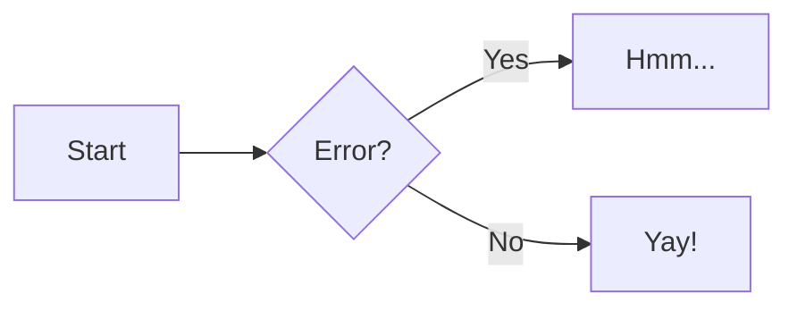

# Bartleby — Python Static Site Generator Specification

## Overview

Bartleby is a batteries-included Python static site generator for people who build content-heavy sites — blogs, tutorials, documentation, conference sites — and want everything in one tool. Named after Melville's scrivener, Bartleby ships with a Material Design theme, a modern frontend stack (Tailwind CSS, Alpine.js, HTMX), multiple content types with build-time metadata validation, a flexible taxonomy system, and every markdown extension you'd reach for — all out of the box.

Bartleby draws architectural ideas from Hugo (content types, taxonomies, template lookup, shortcodes) and MkDocs (YAML-driven config, simple defaults), but it's its own tool. The theme is reimplemented from scratch using Tailwind and Alpine.js rather than ported from mkdocs-material, making it genuinely extensible — users can modify styles and behavior directly in template overrides without reverse-engineering a complex CSS/JS build system.

## Motivation

- The Python ecosystem needs a content-architecture-first SSG. MkDocs is great for docs but limited for blogs, tutorials, and mixed-content sites. Hugo has the right architecture but is written in Go.
- mkdocs-material's move toward Zensical introduces uncertainty for users who depend on the current open-source theme.
- Existing Python SSGs make you assemble features from plugins. Bartleby ships them — search, feeds, taxonomies, do-markdown, pymdownx, metadata validation, HTMX for forms — so you spend time writing content, not configuring tools.
- Bartleby will serve both Mason Egger's personal site and PyTexas, with potential for broader adoption in the Python community.

## Design Principles

1. **Batteries included** — search, RSS/Atom, sitemap, syntax highlighting, do-markdown, pymdownx, icon packs, Tailwind CSS, Alpine.js, HTMX, dark mode — all ship out of the box. The library size doesn't matter; users ship the rendered output, not the library.
2. **Simple by default, powerful when you need it** — YAML config and sensible defaults get you running immediately. When you need customization, the escape hatches are clean and predictable.
3. **Content architecture first** — multiple content types with their own metadata schemas, URL patterns, pagination, and taxonomies. Build-time validation catches errors before deployment, not after.
4. **Extensible by design** — Tailwind utility classes and Alpine.js directives are visible in templates. Override a partial and you can see and modify both styles and behavior. No opaque CSS class names or hidden JS component trees.
5. **Material is the theme** — no theme marketplace, no separate theme package. Material Design is built in, reimplemented with Tailwind CSS for clean customization. Override templates and add `extra_css` if you want a different look.
6. **Plugin-friendly** — extend via pip packages or local Python files in a `plugins/` directory.

---

## Configuration

### File: `bartleby.yml`

The single configuration file for a Bartleby site. Modeled after `mkdocs.yml` but with additional power for content types and taxonomies.

```yaml
site:
  title: "Mason Egger"
  url: "https://masonegger.com"
  description: "Personal site of Mason Egger"
  author: "Mason Egger"
  default_image: /images/default-social.png  # Fallback Open Graph image
  twitter: "@maboroshi"                       # Twitter handle for cards

nav:
  - Home: index.md
  - Blog: blog/
  - Tutorials: tutorials/
  - Speaking: speaking/
  - About: about.md

# Omit nav entirely to auto-generate from directory structure.
# Auto-generated nav uses directory names as section titles and
# file titles (from front matter or filename) as page titles,
# sorted alphabetically.

theme:
  palette:
    # Named shortcuts (e.g., "indigo", "teal", "deep-purple") or hex values
    primary: "#283618"       # or: primary: indigo
    accent: "#BC6C25"        # or: accent: teal
    background: "#FEFAE0"
  color_mode:
    default: system          # "light", "dark", or "system"
    toggle: true             # Show light/dark toggle button
  features:
    - search
    - navigation.tabs
    - navigation.sections
    - content.code.copy
    - content.code.annotate
    - content.tooltips
  icon_packs:                # All enabled by default; set to false to exclude
    material: true           # Material Design Icons
    fontawesome: true        # FontAwesome (brands, solid, regular)
    octicons: true           # GitHub Octicons
    simple: true             # Simple Icons
    # simple: false          # ← explicitly disable a pack
  logo: static/logo.png
  favicon: static/favicon.ico
  font:
    text: Roboto
    code: Roboto Mono

authors_file: .authors.yml  # Default location for author definitions

content_types:
  blog:
    path: blog/posts
    url_base: blog              # Optional: URL prefix (default: derived from filepath)
    url_format: "{date:%Y/%m/%d}/{slug}"  # Optional: default is path-based
    pagination:
      enabled: true
      per_page: 10
    taxonomies: [tags, categories]
    feeds: [rss, atom]
    readtime: true
    excerpt_separator: "<!-- more -->"
  tutorials:
    path: tutorials/posts
    pagination:
      enabled: true
      per_page: 10
    taxonomies: [tags, categories]
    feeds: [rss]
    readtime: true
    excerpt_separator: "<!-- more -->"
    metadata:
      last_verified:
        type: date
        required: true
      first_published:
        type: date
        required: true
      difficulty:
        type: string
        required: false
        choices: [beginner, intermediate, advanced]
  speaking:
    path: speaking/posts
    pagination:
      enabled: false
    taxonomies: [tags]
    feeds: [rss]

taxonomies:
  tags:
    slug_format: "tag:{slug}"   # URL slug format
  categories:
    slug_format: "category:{slug}"

exclude_patterns:
  - "_drafts/**"
  - "_*.md"
  - ".git/**"

markdown_extensions:
  - pymdownx.superfences:
      custom_fences:
        - name: mermaid
          class: mermaid
  - do_markdown.fence:
      allowed_environments: []

plugins:
  - search
  - rss

ai:
  llms_txt: true             # Generate llms.txt (site overview for LLMs)
  llms_full_txt: true        # Generate llms-full.txt (full content dump)
  markdown_variants: true    # Write .md files alongside HTML for every page
  robots:                    # AI-specific robots.txt directives
    allow: [GPTBot, ClaudeBot, PerplexityBot]
    # disallow: [GPTBot]     # ← block specific AI crawlers
  skills:
    output_dir: .claude/skills   # Where to write generated skills
    analyze_content: true        # Extract voice/patterns from existing content
    include_examples: 3          # Example posts per content type to include in skills
    style_guide: null            # Optional: path to explicit style rules (e.g., content/style-guide.md)
    regenerate_on_build: false   # Auto-regenerate skills on `bartleby build`
  agent_context:
    voice: null                  # e.g., "Technical but approachable. Second person. Active voice."
    audience: null               # e.g., "Python developers with 2+ years experience"
    constraints: []              # e.g., ["All code examples must be runnable", "Include prerequisites section in tutorials"]

dev_server:
  host: "127.0.0.1"
  port: 8000
```

### Configuration Sections

- **site**: Global site metadata (title, URL, description, author) and SEO defaults (default_image, twitter handle).
- **nav**: MkDocs-style navigation definition. Ordered list of nav items. Supports nesting. Omit to auto-generate from directory structure.
- **theme**: Material theme configuration (palette, color mode, features, icon packs, logo, favicon, fonts).
- **authors_file**: Path to the authors definition file (default: `.authors.yml`).
- **content_types**: Define content sections with their own paths, URL bases, URL formats, pagination, taxonomy, feed generation, read time, excerpts, and metadata schemas.
- **taxonomies**: Site-wide taxonomy definitions with slugification options. Content types opt in via their `taxonomies` list.
- **exclude_patterns**: Gitignore-style patterns to exclude files from content discovery.
- **markdown_extensions**: Configure Python-Markdown extension options. All default extensions (do-markdown, pymdownx, standard) are loaded automatically — this section is for overriding their configuration or adding new extensions.
- **plugins**: List of enabled plugins. Pip-installed packages and local `plugins/` files are both valid.
- **ai**: AI and agent integration settings — control `llms.txt`, `llms-full.txt`, markdown variant generation, AI crawler directives in `robots.txt`, skill generation configuration, and agent context (voice, audience, constraints).
- **dev_server**: Development server configuration (host, port).

### Config Validation

Bartleby validates `bartleby.yml` at load time:

- Required fields: `site.title`, `site.url`
- Content type paths must exist under `content/`
- Taxonomy names referenced in content types must be defined in `taxonomies`
- Markdown extension names must be importable
- Plugin names must be discoverable (entry points or `plugins/` directory)
- Invalid config produces clear error messages with the offending key path

---

## Authors

### Author Definitions

Authors are defined in a YAML file (default: `.authors.yml` at project root), following mkdocs-material's convention:

```yaml
authors:
  mason:
    name: Mason Egger
    description: "Developer Advocate & Python enthusiast"
    avatar: https://avatars.githubusercontent.com/u/...
    url: https://masonegger.com
  guest:
    name: Guest Author
    description: "Community contributor"
```

### Usage in Content

Reference authors by key in front matter:

```yaml
---
title: "My Post"
authors:
  - mason
  - guest
---
```

### Author Data in Templates

Templates receive resolved author objects (not just keys):

```jinja2

  
  <a href="{{ author.url }}">{{ author.name }}</a>

```

### Validation

- Author keys referenced in front matter must exist in the authors file
- Missing author keys produce a build error with the offending file path and key

---

## Content Organization

### Directory Structure

```
my-site/
├── bartleby.yml
├── .authors.yml            # Author definitions
├── content/
│   ├── index.md
│   ├── about.md
│   ├── blog/
│   │   ├── index.md        # Optional: content displayed above post listing
│   │   └── posts/
│   │       ├── 001-first-post.md
│   │       └── 002-second-post.md
│   ├── tutorials/
│   │   ├── index.md        # Optional: content displayed above tutorial listing
│   │   └── posts/
│   │       └── deploy-with-temporal.md
│   └── speaking/
│       ├── index.md        # Optional: content displayed above talks listing
│       └── posts/
│           ├── pycon-2025.md
│           └── pycon-2025-slides.pdf  # Co-located asset, copied to output
├── templates/               # User template overrides
├── plugins/                 # Local plugin files
├── static/                  # Site-wide static assets (logo, favicon, etc.)
└── site/                    # Build output (generated)
```

### Listing Pages

Each content type automatically generates a listing page at its base URL (e.g., `/blog/`). The listing shows posts in reverse chronological order with excerpts, pagination, and metadata.

If a `content/{type}/index.md` file exists, its rendered content is displayed **above** the auto-generated post listing. This allows users to add introductory text, custom markup, or any content before the posts. If no `index.md` exists, the listing page renders with just the post listing.

### Front Matter

Every content file uses YAML front matter. Standard fields plus content-type-specific fields defined in `bartleby.yml`.

```yaml
---
title: "Deploy with Temporal"
description: "Learn how to deploy workflows with Temporal"
date: 2026-03-01
last_verified: 2026-03-10
first_published: 2024-06-15
difficulty: intermediate
draft: false
tags:
  - python
  - temporal
categories:
  - devops
template: custom-tutorial.html  # Optional: override template lookup
url: custom/path/to/page        # Optional: override URL (default is path-based)
authors:
  - mason
---
```

### Standard Front Matter Fields

These fields are recognized on all content:

| Field | Type | Description |
|-------|------|-------------|
| `title` | string | Page title (required) |
| `description` | string | Page description / meta description |
| `date` | date | Publication date |
| `draft` | bool | Exclude from production builds (default: `false`) |
| `template` | string | Override template lookup |
| `url` | string | Override the generated URL path |
| `url_base` | string | Override the URL base prefix (keeps `url_format` pattern) |
| `authors` | list | Author keys from `.authors.yml` |
| `{taxonomy}` | list | Values for any configured taxonomy (e.g., `tags`, `categories`) |

### Content Features

- **Excerpts**: Use the configured separator (default `<!-- more -->`) to define post excerpts for listing pages. Content before the separator becomes the excerpt. If no separator is present and the content type has `excerpt_separator` configured, the first paragraph is used.
- **Drafts**: Set `draft: true` to exclude from production builds. Shown during `bartleby serve`.
- **Read time**: When `readtime: true` is set on a content type, Bartleby calculates estimated reading time and makes it available in templates as `page.readtime` (in minutes).
- **Custom metadata**: Content-type-specific fields defined in config, validated at build time.

### Static Files and Co-Located Assets

Non-markdown files are handled in two ways:

**Co-located assets** — files placed alongside content in `content/` are copied to the build output following the page's URL, not the source file path. This ensures relative links always work, even when `url_format` changes the page's output path:

```
# Path-based URLs (default) — source and output paths match:
content/speaking/posts/pycon-2025.md          → /speaking/posts/pycon-2025/
content/speaking/posts/pycon-2025-slides.pdf  → /speaking/posts/pycon-2025-slides.pdf

# With url_format — assets follow the page's URL:
content/blog/posts/my-post.md                → /blog/2026/03/01/my-post/  (via url_format)
content/blog/posts/diagram.png               → /blog/2026/03/01/my-post/diagram.png
```

Reference co-located assets with relative links from the content file:

```markdown
Download the [slides](pycon-2025-slides.pdf).

```

Relative links work regardless of `url_format` because assets always follow their page's output URL. For path-based URLs (no `url_format`), this is a no-op since source and output paths already align.

**Site-wide static assets** — the `static/` directory at the project root is for assets shared across the site (logo, favicon, fonts, global CSS/JS). Copied to the root of the build output: `static/logo.png` → `/logo.png`.

### Cross-References

Link between content pages using relative markdown file paths. Bartleby rewrites these to the correct output URLs at build time, following MkDocs's convention:

```markdown
Check out my [Temporal tutorial](../tutorials/posts/deploy-with-temporal.md).
See the [about page](../../about.md).
```

Relative paths are resolved from the current file's location within `content/`. Bartleby validates that the target file exists and produces a build error (or warning in non-strict mode) for broken links. This catches dead links before deployment.

### File Exclusion

Files matching `exclude_patterns` in config are ignored during content discovery. Patterns use gitignore syntax. Defaults:

```yaml
exclude_patterns:
  - "_drafts/**"
  - "_*.md"
  - ".git/**"
```

---

## URL Generation

### Default: Path-Based

By default, URLs mirror the content directory structure:

- `content/blog/posts/my-first-post.md` → `/blog/posts/my-first-post/`
- `content/about.md` → `/about/`

### Per-Content-Type URL Format

Content types can define a `url_format` string with placeholders:

```yaml
content_types:
  blog:
    url_format: "{date:%Y/%m/%d}/{slug}"
```

Available placeholders:

| Placeholder | Description | Example |
|-------------|-------------|---------|
| `{slug}` | Slugified filename (or front matter `slug` field) | `my-first-post` |
| `{date:%Y/%m/%d}` | Date with strftime format | `2026/03/01` |
| `{title}` | Slugified title | `deploy-with-temporal` |
| `{categories}` | First category (slugified) | `devops` |

The URL base is prepended to the formatted URL. By default, the URL base is derived from the content file's directory path relative to `content/`. Content types can override this with `url_base` in config:

```yaml
content_types:
  blog:
    path: blog/posts           # Files live in content/blog/posts/
    url_base: blog             # URLs start with /blog/ (not /blog/posts/)
    url_format: "{date:%Y/%m/%d}/{slug}"
```

This produces: `/blog/2026/03/01/my-first-post/`.

If `url_base` is not set, the default path-based URL for `content/blog/posts/my-first-post.md` would be `/blog/posts/my-first-post/`. Setting `url_base: blog` shortens it to `/blog/{url_format}/`.

### Per-Page URL Override

Any page can override its URL with the `url` front matter field:

```yaml
---
url: custom/path/to/page
---
```

This produces an absolute path: `/custom/path/to/page/`.

Pages can also override just the URL base with `url_base` in front matter, keeping the `url_format` pattern:

```yaml
---
url_base: articles
---
```

---

## Build-Time Metadata Validation

When a content type defines a `metadata` schema in `bartleby.yml`, Bartleby validates every content file of that type at build time.

### Validation Rules

- **required: true** — build fails (or warns, configurable) if the field is missing
- **type: date** — value must parse as a valid date
- **type: string** — value must be a string
- **type: integer** — value must be an integer
- **type: boolean** — value must be a boolean
- **type: list** — value must be a list
- **choices: [...]** — value must be one of the listed options

### Validation Behavior

- Validation runs before rendering, so errors are caught early
- Missing required fields produce clear error messages with file paths
- Type mismatches produce clear error messages
- Invalid choice values list the valid options
- Configurable: strict mode (fail build) vs. warning mode (log and continue)

### Testable Components

- Schema parser: reads content type metadata definitions from config
- Validator: checks front matter against schema, returns structured errors
- Reporter: formats validation errors for CLI output

---

## Markdown Pipeline

### Engine: Python-Markdown

Bartleby uses Python-Markdown as its rendering engine. All extensions — do-markdown, pymdownx, and standard — are loaded by default as core functionality. Users never need to add them as plugins or list them in config. do-markdown is a first-class citizen; if a do-markdown extension is missing a needed feature, the fix goes upstream in do-markdown.

### Extension Loading Order

Extension processor ordering matters. Bartleby manages this internally to ensure correct behavior:

1. `do_markdown.fence` preprocessor (priority 40) — extracts `[label]`, `[secondary_label]`, `[environment]` directives from code blocks before superfences processes them
2. `pymdownx.superfences` preprocessor (priority 25) — processes fenced code blocks into HTML after directives are extracted
3. `do_markdown.fence` postprocessor (priority 25) — injects labels, environment classes, and line prefixes into the HTML that superfences generated
4. `do_markdown.highlight` (priority 175 inline, 25 post) — text highlighting; inline processor converts `<^>` in prose, postprocessor handles `<^>` inside code blocks
5. All other extensions in standard priority order

Users do not need to worry about ordering — Bartleby handles it.

### Default Extensions

**do-markdown extensions (first-class, loaded automatically):**
- `do_markdown.fence` — labels, secondary labels, environment tags, line numbers, command prefixes, custom prefixes
- `do_markdown.highlight` — inline text highlighting with `<^>` markers (primarily for use inside code blocks)
- `do_markdown.youtube` — YouTube embed blocks
- `do_markdown.codepen` — CodePen embed blocks
- `do_markdown.twitter` — Twitter/X embed blocks
- `do_markdown.instagram` — Instagram embed blocks
- `do_markdown.slideshow` — Image slideshow blocks
- `do_markdown.image_compare` — Before/after image comparison blocks

**PyMdown Extensions (pymdownx, loaded automatically):**
- `pymdownx.superfences` — enhanced fenced code blocks, custom fences (Mermaid)
- `pymdownx.highlight` — syntax highlighting with Pygments
- `pymdownx.inlinehilite` — inline code highlighting
- `pymdownx.tabbed` — content tabs
- `pymdownx.details` — collapsible details/summary blocks
- `pymdownx.tasklist` — GitHub-style task lists
- `pymdownx.arithmatex` — math notation (MathJax/KaTeX)
- `pymdownx.keys` — keyboard key rendering
- `pymdownx.mark` — text marking/highlighting with `==` syntax
- `pymdownx.caret` — superscript and insert with `^^` and `^`
- `pymdownx.tilde` — subscript and strikethrough with `~~` and `~`
- `pymdownx.critic` — critic markup for suggested changes
- `pymdownx.smartsymbols` — smart symbol replacement
- `pymdownx.emoji` — emoji and icon support
- `pymdownx.snippets` — file inclusion and glossary support
- `pymdownx.blocks.caption` — image/figure captions

**Standard Python-Markdown extensions (loaded automatically):**
- `tables` — data tables
- `toc` — table of contents generation
- `attr_list` — attribute lists for adding CSS classes, IDs, and attributes
- `def_list` — definition lists
- `footnotes` — footnote references and content
- `admonition` — callout/note boxes
- `abbr` — abbreviations and tooltips
- `md_in_html` — markdown inside HTML blocks

### Extension Configuration

Default extensions are always loaded. The `markdown_extensions` config section allows overriding their options or adding new extensions:

```yaml
markdown_extensions:
  # Override options for a default extension
  - pymdownx.superfences:
      custom_fences:
        - name: mermaid
          class: mermaid
  # Add a third-party extension
  - my_custom_extension:
      option: value
```

### Plugin-Controlled Extensions

Plugins can register additional Python-Markdown extensions via the `on_config` hook.

---

## Content Reference

This section documents all content formatting features available in markdown files. These features match mkdocs-material's reference syntax, with additional capabilities from do-markdown.

### Admonitions

Callout boxes for notes, warnings, tips, etc. Powered by `admonition` and `pymdownx.details`.

**Basic syntax:**

```markdown
!!! note
    This is a note admonition. Content must be indented by four spaces.

!!! warning "Custom Title"
    Warning with a custom title.

!!! tip ""
    Tip with no title (empty string removes the title).
```

**Supported types:** `note`, `abstract`, `info`, `tip`, `success`, `question`, `warning`, `failure`, `danger`, `bug`, `example`, `quote`

**Collapsible (details/summary):**

```markdown
??? tip "Click to expand"
    This content is hidden by default.

???+ warning "Expanded by default"
    The + makes it start open.
```

**Inline admonitions** (float beside text):

```markdown
!!! info inline end "Right-aligned"
    This floats to the right of the following text.

!!! info inline "Left-aligned"
    This floats to the left of the following text.
```

Inline admonitions must be declared *before* the content they float beside.

**Nested admonitions:**

```markdown
!!! note "Outer"
    Outer content.

    !!! warning "Inner"
        Nested admonition with additional indentation.
```

### Annotations

Numbered markers in content that expand to show additional information on click. Annotations require the `content.code.annotate` theme feature.

**In regular content:**

```markdown
Lorem ipsum dolor sit amet, (1) consectetur adipiscing elit.
{ .annotate }

1.  I'm an annotation! Supports `code`, **formatting**, images, etc.
```

The `(1)` marker appears inline; the numbered list below defines the annotation content.

**Nested annotations:**

```markdown
Text with (1) annotation.
{ .annotate }

1.  First annotation with (1) another annotation inside.
    { .annotate }

    1.  Nested annotation content.
```

**In admonitions:**

```markdown
!!! note annotate "Title with (1) annotation"

    Body text with (2) annotation.

1.  Title annotation content.
2.  Body annotation content.
```

**In content tabs:**

```markdown
=== "Tab 1"

    Text with (1) annotation.
    { .annotate }

    1.  Tab annotation content.
```

**In code blocks:**

````markdown
```yaml
theme:
  features:
    - content.code.annotate # (1)
```

1.  This is a code annotation.
````

Use `# (1)!` to strip the comment character from the rendered output.

### Code Blocks

Enhanced code blocks with titles, line numbers, highlighting, annotations, and copy buttons. Powered by `pymdownx.highlight`, `pymdownx.superfences`, and `do_markdown.fence`.

**Basic with language:**

````markdown
```python
print("hello world")
```
````

**With title** (mkdocs-material syntax):

````markdown
```python title="script.py"
print("hello world")
```
````

**With label** (do-markdown syntax — both syntaxes are supported):

````markdown
```python
[label script.py]
[secondary_label Output]
print("hello world")
```
````

Both `title="..."` and `[label ...]` produce a title on the code block. do-markdown's `[secondary_label]` adds a second label — useful for showing both filename and output type.

**Line numbers:**

````markdown
```python linenums="1"
def hello():
    print("hello")
```
````

**Highlight specific lines:**

````markdown
```python hl_lines="2 3"
def hello():
    print("hello")  # highlighted
    return True      # highlighted
```
````

Ranges also work: `hl_lines="3-5"`

**Inline token highlighting** (do-markdown — works inside code blocks):

````markdown
```python
print(<^>"highlighted text"<^>)
```
````

The `<^>` markers highlight specific tokens within a line, complementing the line-level `hl_lines` feature.

**Command prefixes** (do-markdown):

````markdown
```bash
[command]
ls -la
cd /tmp
```
````

Adds `$` prefixes to each line, indicating shell commands.

**Environment tags** (do-markdown):

````markdown
```python
[environment local]
python manage.py runserver
```
````

Adds an environment label to the code block.

**Code annotations:**

````markdown
```yaml
theme:
  features:
    - content.code.annotate # (1)
```

1.  This annotation explains the feature.
````

Use `# (1)!` to strip the comment syntax from the rendered code.

**Copy button:** Enabled globally via `content.code.copy` theme feature. Per-block control with `{ .copy }` or `{ .no-copy }`.

**Inline code highlighting:**

```markdown
The `#!python range()` function generates a sequence.
```

### Content Tabs

Tabbed content blocks for showing alternatives side-by-side. Powered by `pymdownx.tabbed`.

```markdown
=== "Python"

    ```python
    print("Hello")
    ```

=== "JavaScript"

    ```javascript
    console.log("Hello");
    ```
```

**Tabs in admonitions:**

```markdown
!!! example

    === "Unordered List"

        * Item one
        * Item two

    === "Ordered List"

        1. Item one
        2. Item two
```

**Linked tabs:** When `content.tabs.link` theme feature is enabled, clicking a tab label syncs all matching tab labels across the page.

### Data Tables

Standard markdown tables with optional sorting. Powered by `tables`.

```markdown
| Method   | Description          |
| -------- | -------------------- |
| `GET`    | Fetch resource       |
| `PUT`    | Update resource      |
| `DELETE` | Delete resource      |
```

**Column alignment** via colons in the separator row:

```markdown
| Left     | Center   | Right    |
| :------- | :------: | -------: |
| text     | text     | text     |
```

**Sortable tables** are enabled via theme JavaScript (tablesort.js).

### Diagrams

Mermaid diagrams rendered client-side. Powered by `pymdownx.superfences` with a custom fence.

````markdown

````

Supported diagram types: flowcharts, sequence diagrams, state diagrams, class diagrams, entity-relationship diagrams, and all other Mermaid diagram types.

Requires `pymdownx.superfences` configured with the mermaid custom fence (included in Bartleby's defaults).

### Footnotes

Reference-style footnotes. Powered by `footnotes`.

```markdown
Lorem ipsum[^1] dolor sit amet[^note].

[^1]: Single-line footnote content.

[^note]:
    Multi-line footnote content.
    Indent continuation lines by four spaces.
```

Footnotes are rendered at the bottom of the page with automatic backlinks. Identifiers can be numbers or names.

When the `content.footnote.tooltips` theme feature is enabled, footnotes display as inline tooltips on hover.

### Formatting

Text formatting beyond standard markdown. Powered by `pymdownx.mark`, `pymdownx.caret`, `pymdownx.tilde`, `pymdownx.critic`, and `pymdownx.keys`.

**Highlighting/marking:**

```markdown
==This text is highlighted==
```

Note: do-markdown's `<^>text<^>` syntax also produces `<mark>` tags and is supported, but `==text==` is the preferred syntax for prose. Reserve `<^>` for highlighting inside code blocks where `==` cannot reach.

**Subscript and superscript:**

```markdown
H~2~O (subscript)
A^T^A (superscript)
```

**Insert and delete:**

```markdown
^^This was inserted^^
~~This was deleted~~
```

**Keyboard keys:**

```markdown
++ctrl+alt+del++
++cmd+shift+p++
```

**Critic markup** (suggested changes):

```markdown
{--deleted text--}
{++added text++}
{~~old text~>new text~~}
{==highlighted text==}
{>>inline comment<<}
```

### Grids

Card layouts and grid arrangements. Powered by `attr_list` and `md_in_html`. Class names use mkdocs-material conventions (`grid`, `cards`) — Bartleby maps these to Tailwind grid/flexbox styles via `@apply`.

**Card grid (list syntax):**

```html
<div class="grid cards" markdown>

- :fontawesome-brands-python: __Python__ for backend logic
- :fontawesome-brands-js: __JavaScript__ for interactivity
- :fontawesome-brands-css3: __CSS__ for styling

</div>
```

**Cards with details:**

```html
<div class="grid cards" markdown>

-   :material-clock-fast:{ .lg .middle } __Set up in 5 minutes__

    ---

    Install and get running quickly.

    [:octicons-arrow-right-24: Getting started](#)

</div>
```

**Generic grid** (arrange any blocks side by side):

```html
<div class="grid" markdown>

=== "Tab 1"
    Content here

=== "Tab 2"
    Content here

</div>
```

### Icons and Emojis

Inline icons and emojis. Powered by `pymdownx.emoji`.

**Emojis:**

```markdown
:smile: :heart: :rocket:
```

**Icons** (Material Design, FontAwesome, Octicons, Simple Icons):

```markdown
:material-account-circle:
:fontawesome-brands-github:
:octicons-heart-fill-24:
```

**Icons with styling** (via `attr_list`):

```markdown
:fontawesome-brands-youtube:{ .youtube }
:octicons-heart-fill-24:{ .heart }
```

Custom CSS classes can add colors, animations, or sizing.

### Images

Enhanced image handling. Powered by `attr_list` and `md_in_html`.

**Alignment:**

```markdown
{ align=left }
{ align=right }
```

**With caption:**

```markdown
{ width="300" }
/// caption
Image caption text
///
```

Or using HTML figure:

```html
<figure markdown="span">
  { width="300" }
  <figcaption>Image caption</figcaption>
</figure>
```

**Lazy loading:**

```markdown
{ loading=lazy }
```

**Light/dark mode variants:**

```markdown


```

### Lists

Enhanced list features. Powered by `def_list` and `pymdownx.tasklist`.

**Definition lists:**

```markdown
`Term`
:   Definition of the term. Indent by four spaces.

`Another term`
:   Another definition.
```

**Task lists:**

```markdown
- [x] Completed task
- [ ] Incomplete task
    - [x] Nested completed subtask
    - [ ] Nested incomplete subtask
```

### Math

Mathematical notation. Powered by `pymdownx.arithmatex` with MathJax or KaTeX.

**Inline math:**

```markdown
The equation $f(x) = x^2$ is a parabola.
```

**Block math:**

```markdown
$$
\cos x = \sum_{k=0}^{\infty} \frac{(-1)^k}{(2k)!} x^{2k}
$$
```

Alternative delimiters `\(...\)` and `\[...\]` are also supported.

### Tooltips

Enhanced tooltips and abbreviations. Powered by `abbr`, `attr_list`, and `pymdownx.snippets`.

**Link tooltips:**

```markdown
[Hover me](https://example.com "I'm a tooltip!")
```

**Element tooltips** (via `attr_list`):

```markdown
:material-information-outline:{ title="Important information" }
```

**Abbreviations:**

```markdown
The HTML specification is maintained by the W3C.

*[HTML]: Hyper Text Markup Language
*[W3C]: World Wide Web Consortium
```

All instances of the abbreviated term get automatic tooltips on hover.

**Glossary** (shared abbreviations across pages):

Create `includes/abbreviations.md` with abbreviation definitions, then configure `pymdownx.snippets` to auto-append it:

```yaml
markdown_extensions:
  - pymdownx.snippets:
      auto_append:
        - includes/abbreviations.md
```

### Buttons

Styled link buttons. Powered by `attr_list`. Class names use the `md-button` convention from mkdocs-material for content compatibility — Bartleby maps these to Tailwind styles via `@apply`.

```markdown
[Subscribe to newsletter](#){ .md-button }
[Get started](#){ .md-button .md-button--primary }
[Send :fontawesome-solid-paper-plane:](#){ .md-button }
```

### do-markdown Embeds

Media embeds loaded automatically as part of do-markdown. These use do-markdown's own syntax.

**YouTube:**

```markdown
[youtube dQw4w9WgXcQ 270 480]
```

**CodePen:**

```markdown
[codepen username hash theme tabs height]
```

**Twitter/X:**

```markdown
[twitter https://twitter.com/user/status/123 dark 400]
```

**Instagram:**

```markdown
[instagram https://www.instagram.com/p/ABC123/ caption center 400]
```

**Image slideshow:**

```markdown
[slideshow url1 url2 url3 300 600]
```

**Image comparison (before/after):**

```markdown
[compare before.jpg after.jpg 300 600]
```

### Theme Feature Toggles

Some content features are controlled by theme feature flags in `bartleby.yml`:

```yaml
theme:
  features:
    - content.code.copy        # Copy button on code blocks
    - content.code.annotate    # Code annotations
    - content.code.select      # Code selection button
    - content.tabs.link        # Linked content tabs across page
    - content.tooltips         # Enhanced tooltips
    - content.footnote.tooltips  # Footnote tooltips on hover
```

---

## Template System

### Engine: Jinja2

Bartleby uses Jinja2 for all template rendering. The Material theme's templates are reimplemented in Jinja2 using Tailwind CSS and Alpine.js.

### Template Lookup Order

When rendering a page, Bartleby resolves the template using this cascade (first match wins):

1. **Page-specific** — front matter specifies `template: custom.html`
2. **Content type + layout** — `templates/{content_type}/post.html` (for single posts) or `templates/{content_type}/list.html` (for listing pages)
3. **Content type default** — `templates/{content_type}/base.html`
4. **Base defaults** — `templates/defaults/post.html`, `templates/defaults/list.html`
5. **Theme fallback** — Bartleby's built-in Material theme templates

At each level, user project templates (in `templates/`) take precedence over theme templates.

For taxonomy pages, the lookup order is:

1. `templates/{content_type}/taxonomy/{taxonomy_name}.html` (e.g., `templates/blog/taxonomy/tags.html`)
2. `templates/taxonomy/{taxonomy_name}.html`
3. `templates/defaults/taxonomy.html`
4. Theme fallback

For static templates (404, etc.):

1. `templates/{name}.html`
2. Theme fallback

### Template Context

Templates receive a context object with:

- `site` — global site configuration (title, URL, description)
- `page` — current page data (title, content, metadata, URL, authors, readtime, toc, etc.)
- `page.previous` / `page.next` — adjacent pages in navigation order
- `nav` — navigation structure from config
- `pages` — all pages (for cross-referencing, related posts, etc.)
- `taxonomies` — all taxonomy terms and their associated pages
- `config` — full Bartleby configuration
- `build` — build metadata (date, Bartleby version)

### Template Types

- **post.html** — single content page (blog post, tutorial, talk)
- **list.html** — paginated listing page (blog index, category page)
- **page.html** — static page (about, home)
- **taxonomy.html** — taxonomy term listing (all posts with tag "python")
- **taxonomy_index.html** — taxonomy overview (all tags, all categories)
- **home.html** — homepage (special layout)
- **404.html** — not found page (static template, rendered once)

### Shortcodes

Reusable content snippets invocable from markdown. Implemented as Jinja2 template fragments using square-bracket syntax to avoid colliding with Jinja2's `` delimiters.

**Syntax:**

```markdown
[% note %]
This is an important note.
[% /note %]

[% callout type="warning" title="Be careful" %]
This action cannot be undone.
[% /callout %]

[% include "partials/signup-form.html" %]
```

**Inline shortcodes** (no closing tag):

```markdown
[% version %]
[% current_date format="%Y-%m-%d" %]
```

Shortcodes are resolved during markdown preprocessing, before the markdown engine runs. They are rendered as Jinja2 template fragments with access to the full page context.

**Shortcode template location:** `templates/shortcodes/{name}.html` (user) or built-in theme shortcodes.

**Note:** Many common embed use cases (YouTube, CodePen, Twitter, Instagram) are already handled by do-markdown extensions using their own syntax (e.g., `[youtube dQw4w9WgXcQ]`). Shortcodes are for custom reusable components beyond what do-markdown provides.

---

## Material Theme (Built-In)

### Approach: Reimplemented with Modern Frontend Stack

Rather than porting mkdocs-material's CSS/JS (62 SCSS files, 115 TypeScript files using RxJS + Preact), Bartleby reimplements the Material Design aesthetic using a modern, extensible frontend stack:

- **Tailwind CSS** — utility-first styling. Classes are visible directly in templates, making user overrides intuitive. Compiled at package build time via the Tailwind standalone CLI (no Node dependency for users). PurgeCSS ensures minimal production bundles.
- **Alpine.js** — lightweight (15KB) reactive JS for theme interactivity: search modal, sidebar toggles, content tabs, dark mode, scroll tracking, tooltips. Logic lives in HTML attributes (`x-data`, `x-show`, `x-on`), visible and modifiable in template overrides.
- **HTMX** — included as a user-facing tool for adding server-backed interactions (contact forms, newsletter signups, API calls) to static pages. Not used by the default theme, but available out of the box for users who need it.
- **lunr.js** — client-side search engine.

This "batteries included" philosophy means users get Tailwind, Alpine, HTMX, and lunr.js without installing anything. The library size doesn't matter — users ship the rendered output, not the library.

### Why Not Port mkdocs-material's CSS/JS?

mkdocs-material's frontend is tightly coupled: TypeScript components use DOM selectors that expect specific HTML class names and element structures produced by the templates. Porting the CSS/JS "as-is" while rewriting templates requires reverse-engineering every selector in 115 TypeScript files. The maintenance burden is high and extensibility is poor — users overriding templates see opaque BEM class names (`md-header__inner md-grid`) with no way to understand the styles without tracing through SCSS.

With Tailwind, a user overriding a template partial sees `class="flex items-center gap-4 px-6"` and can modify styles directly. With Alpine, they see `x-data="{ open: false }"` and understand the behavior. This is a transformative extensibility difference.

### Theme Components

- **Header** — site title, navigation tabs, search button, color scheme toggle
- **Navigation drawer** — sidebar navigation with collapsible sections (Alpine.js `x-data`), active state tracking
- **Table of contents sidebar** — auto-generated from heading structure, scroll spy via Alpine.js `x-intersect`
- **Search modal** — Alpine.js modal with lunr.js search, keyboard navigation, result highlighting
- **Content area** — typography, code blocks, admonitions, tables, all content elements (Tailwind typography plugin + custom styles)
- **Footer** — previous/next navigation, site info, social links
- **Blog layouts** — post listings with pagination, post pages with metadata (authors, date, readtime, tags)
- **Taxonomy layouts** — tag/category listing pages, term pages
- **404 page** — styled not-found page
- **Mobile responsive** — Tailwind responsive prefixes (`md:`, `lg:`), Alpine.js hamburger menu

### Theme Configuration

Configurable via `bartleby.yml` `theme` section:

- Color palette (primary, accent, background) — named shortcuts (`indigo`, `teal`, etc.) or arbitrary hex values, mapped to Tailwind CSS custom properties
- Color mode — default to system preference (`prefers-color-scheme`), manual toggle with `localStorage` persistence. Configurable: `default: system|light|dark`, `toggle: true|false`
- Icon packs — Material Design Icons, FontAwesome, Octicons, Simple Icons all enabled by default. Set a pack to `false` to exclude it. Referenced in content via `:material-account:`, `:fontawesome-brands-github:`, etc. Only icons actually used in content are included in the build output (tree-shaking).
- Logo and favicon
- Social links
- Font customization
- Feature toggles:
  - `search` — search modal
  - `navigation.tabs` — top-level nav as tabs
  - `navigation.sections` — collapsible sidebar sections
  - `navigation.top` — back-to-top button
  - `navigation.footer` — previous/next in footer
  - `navigation.indexes` — section index pages
  - `navigation.tracking` — URL updates with anchor on scroll
  - `content.code.copy` — copy button on code blocks
  - `content.code.annotate` — code annotations
  - `content.code.select` — code selection button
  - `content.tabs.link` — linked content tabs across page
  - `content.tooltips` — enhanced tooltips
  - `content.footnote.tooltips` — footnote tooltips on hover
  - `content.action.edit` — edit page link
  - `content.action.view` — view source link
  - `search.highlight` — highlight search terms on page
  - `search.suggest` — search suggestions
  - `search.share` — shareable search links
  - `toc.follow` — TOC follows scroll position

### Theme Asset Pipeline

During Bartleby **development**: Tailwind standalone CLI compiles CSS from template classes. No Node dependency.

In the **shipped package**: Compiled CSS, Alpine.js, HTMX, and lunr.js are vendored. Users never need Tailwind, Node, or npm.

For **user template overrides**: The shipped CSS includes comprehensive Tailwind utility classes covering common customization needs. Users needing additional styles add `extra_css` files — same workflow as mkdocs-material today.

---

## Search

### Implementation

Replicate mkdocs-material's search system exactly:

- **Build time**: Generate a JSON search index from all rendered content (titles, headings, body text, tags)
- **Client side**: Ship lunr.js (or lunr equivalent) to the browser
- **UI**: Alpine.js-powered search modal with instant results, keyboard navigation, section highlighting
- **Plugin**: Implemented as a built-in plugin (enabled by default)

### Search Index Format

```json
{
  "config": {
    "lang": ["en"],
    "separator": "[\\s\\-]+",
    "pipeline": ["stemmer", "stopWordFilter", "trimmer"]
  },
  "docs": [
    {
      "location": "/blog/my-post/#section",
      "title": "Section Title",
      "text": "Extracted text content...",
      "tags": ["python", "temporal"]
    }
  ]
}
```

### Testable Components

- Index builder: extracts searchable text from rendered pages, generates JSON index
- Search configuration: handles indexing options (what to index, field weights)
- Template integration: search modal HTML/JS included in base template

---

## Taxonomy System

### Taxonomy Definitions

Taxonomies are defined in `bartleby.yml` at the site level. Content types opt in to specific taxonomies via their `taxonomies` list.

```yaml
taxonomies:
  tags:
    slug_format: "tag:{slug}"
  categories:
    slug_format: "category:{slug}"
  series:
    slug_format: "series:{slug}"

content_types:
  blog:
    taxonomies: [tags, categories, series]
  tutorials:
    taxonomies: [tags, categories]
  speaking:
    taxonomies: [tags]
```

A taxonomy value used in front matter is only valid if the content type opts in to that taxonomy. Using `categories` in a speaking post front matter produces a build warning (the value is ignored).

### Generated Pages

For each taxonomy, Bartleby generates pages at two levels:

**Global taxonomy pages** — aggregate across all content types:

- `/tags/` — lists all tags with counts across all content types
- `/tags/python/` — lists all content tagged "python" (blog posts, tutorials, talks)

**Per-content-type taxonomy pages** — scoped to a single content type:

- `/blog/tags/` — lists tags used in blog posts only
- `/blog/tags/python/` — lists blog posts tagged "python"

Per-content-type pages are only generated when that content type opts in to the taxonomy.

### Taxonomy Term Slugification

Term slugs are generated using the `slug_format` defined in the taxonomy config. The `{slug}` placeholder is replaced with a lowercased, hyphenated version of the term.

Example: tag "Temporal Workflows" with `slug_format: "tag:{slug}"` → URL slug `temporal-workflows`, URL path `/tags/temporal-workflows/`.

### Template Support

Taxonomy pages use the `taxonomy.html` and `taxonomy_index.html` templates. Templates have access to:

- `taxonomy.name` — the taxonomy name (e.g., "tags")
- `taxonomy.terms` — all terms with their counts and associated pages
- `taxonomy.term` — the current term (on term pages)
- `taxonomy.pages` — pages for the current term (on term pages)
- `taxonomy.content_type` — the content type (on per-content-type pages, `null` on global pages)

### Taxonomy Pagination

Term pages with many posts are paginated using the same pagination system as content type listings. Pagination settings are inherited from the content type on per-content-type taxonomy pages. Global taxonomy term pages use a default of 20 items per page (configurable in the taxonomy definition).

---

## Feed Generation

### RSS and Atom

Feeds are generated per content type based on configuration:

```yaml
content_types:
  blog:
    feeds: [rss, atom]
```

- Feeds include title, description, date, author, excerpt, and full content
- Feed URLs follow standard conventions (`/blog/feed.xml`, `/blog/atom.xml`)
- Feeds validate against their respective specifications
- Feed `<link>` tags are included in the HTML `<head>` for auto-discovery

### Testable Components

- Feed builder: generates valid RSS 2.0 and Atom 1.0 XML
- Content extraction: pulls correct metadata and content for feed items
- URL generation: produces correct absolute URLs for feed items

---

## Sitemap and Robots

### Sitemap

Auto-generated `sitemap.xml` at build time including all non-draft pages with:

- URL
- Last modified date
- Change frequency (derived from content type)
- Priority (configurable)

A gzipped version (`sitemap.xml.gz`) is also generated.

### Robots.txt

Auto-generated `robots.txt` referencing the sitemap URL. Includes AI-specific crawler directives from the `ai.robots` config:

```
User-agent: *
Allow: /
Sitemap: https://masonegger.com/sitemap.xml

User-agent: GPTBot
Allow: /

User-agent: ClaudeBot
Allow: /

User-agent: PerplexityBot
Allow: /
```

Can be fully overridden by placing a `robots.txt` in `static/`.

---

## AI & Agent Integration

Bartleby is designed for equal drivability by humans and AI agents. This covers two complementary concerns: making the **generated site** consumable by AI systems (LLM-friendly output), and making the **tool itself** operable by AI agents (structured CLI, skill generation, schema introspection).

### Design Philosophy

1. **Every operation has a structured interface** — All CLI commands produce JSON output via `--output json`. An agent never needs to parse human-readable text.
2. **Self-describing schemas** — Agents can discover what's valid (content types, metadata fields, taxonomies, authors) via introspection commands, without reading config files directly.
3. **Non-interactive by default** — Every command is fully operable via flags. Interactive prompts are a convenience for humans, never a requirement.
4. **Skill generation** — Bartleby generates agent skills from site content, teaching AI agents the site's voice, structure, and conventions.
5. **Content as data** — Content is queryable, exportable, and importable in structured formats.

---

### LLM-Friendly Output

Bartleby generates LLM-friendly output by default, making site content easily consumable by AI systems.

#### llms.txt

Auto-generated `llms.txt` at the site root following the [llmstxt.org](https://llmstxt.org) standard. Provides a structured overview of the site:

```
# Mason Egger

> Personal site of Mason Egger

## Blog
- [Deploy with Temporal](https://masonegger.com/blog/2026/03/01/deploy-with-temporal.md): Learn how to deploy workflows with Temporal
- [First Post](https://masonegger.com/blog/2026/01/15/first-post.md): My first blog post

## Tutorials
- [Deploy with Temporal](https://masonegger.com/tutorials/deploy-with-temporal.md): Step-by-step Temporal deployment guide

## Pages
- [About](https://masonegger.com/about.md): About Mason Egger
```

Links point to the `.md` variants so LLMs receive markdown, not HTML. Content is organized by content type. Descriptions come from the `description` front matter field.

Controlled by `ai.llms_txt` config (default: `true`).

#### llms-full.txt

A comprehensive version that inlines the full markdown content of every page, so an LLM can consume the entire site in a single request:

```
# Mason Egger

> Personal site of Mason Egger

## Blog

### Deploy with Temporal

Learn how to deploy workflows with Temporal

[Full markdown content here...]

---

### First Post

My first blog post

[Full markdown content here...]
```

Controlled by `ai.llms_full_txt` config (default: `true`). Disable for large sites where this file would be prohibitively large.

#### Markdown Variants

When `ai.markdown_variants` is enabled (default: `true`), Bartleby writes a `.md` file alongside the HTML for every page:

```
site/blog/2026/03/01/my-post/index.html   ← rendered page
site/blog/2026/03/01/my-post/index.md     ← raw markdown (front matter stripped)
site/about/index.html
site/about/index.md
```

Visiting `/blog/2026/03/01/my-post/index.md` on any static host returns the raw markdown. LLMs and tools that prefer markdown over HTML can append `.md` to any page URL.

#### JSON-LD Structured Data

Bartleby generates Schema.org JSON-LD in the base template for every page:

**For content type posts** (`Article` schema):

```html
<script type="application/ld+json">
{
  "@context": "https://schema.org",
  "@type": "Article",
  "headline": "Deploy with Temporal",
  "author": {"@type": "Person", "name": "Mason Egger", "url": "https://masonegger.com"},
  "datePublished": "2026-03-01",
  "dateModified": "2026-03-10",
  "description": "Learn how to deploy workflows with Temporal",
  "publisher": {"@type": "Organization", "name": "Mason Egger"},
  "mainEntityOfPage": {"@type": "WebPage", "@id": "https://masonegger.com/blog/2026/03/01/deploy-with-temporal/"}
}
</script>
```

**For static pages** (`WebPage` schema):

```html
<script type="application/ld+json">
{
  "@context": "https://schema.org",
  "@type": "WebPage",
  "name": "About",
  "description": "About Mason Egger",
  "url": "https://masonegger.com/about/"
}
</script>
```

#### AI Crawler Policy

The `ai.robots` config controls which AI crawlers can access the site. Directives are merged into the auto-generated `robots.txt`:

```yaml
ai:
  robots:
    allow: [GPTBot, ClaudeBot, PerplexityBot]   # Explicitly allowed
    # disallow: [GPTBot]                          # Explicitly blocked
```

If neither `allow` nor `disallow` is set, no AI-specific directives are added (default `robots.txt` behavior applies).

---

### Skill Generation

Bartleby can generate agent skills — structured prompt files that teach AI coding agents how to create, review, and manage content for a specific site. This is Bartleby's core agent-first feature: the SSG that teaches AI how to write for your site.

#### How It Works

`bartleby generate-skill` reads the site configuration and (optionally) analyzes existing content to produce skill files. These skills are standard markdown files with frontmatter that agent systems (like Claude Code's skill system) can consume.

The generated skills are written to `ai.skills.output_dir` (default: `.claude/skills/`).

#### Generated Skills

**`bartleby-write.md`** — Content creation skill

Teaches an agent to create new content for the site. Includes:

- Exact metadata schema for each content type (required fields, types, valid choices)
- Available authors, taxonomies, and existing taxonomy terms
- Voice and tone patterns (extracted from content analysis or explicit `ai.agent_context` config)
- Structural conventions (heading patterns, section ordering, code-to-prose ratio)
- Example posts (configurable count per content type via `ai.skills.include_examples`)
- The correct CLI command to create posts (`bartleby new post ... --output json`)

**`bartleby-review.md`** — Content review skill

Teaches an agent to review and improve existing content. Includes:

- Site-specific quality criteria derived from content patterns
- Metadata completeness checks
- Cross-reference validation expectations
- Taxonomy consistency rules (e.g., "use existing tags when possible")
- Style conformance guidelines from `ai.agent_context` or analyzed patterns
- The correct CLI command to validate (`bartleby validate --output json`)

**`bartleby-ops.md`** — Site operations skill

Teaches an agent to operate the site. Includes:

- Build, validate, and serve commands with `--output json` examples
- Content query examples for discovering existing pages
- Common maintenance workflows (update dates, fix broken links, manage drafts)
- Export commands for data extraction
- Schema introspection commands for self-discovery

#### Content Analysis

When `ai.skills.analyze_content` is `true` (default), the skill generator performs heuristic analysis of existing content to extract patterns:

| Pattern | How Extracted | Example Output |
|---|---|---|
| Voice/tone | Sentence length distribution, person (1st/2nd/3rd), formality markers | "Second person, technical but approachable, avg sentence 15 words" |
| Structure | Heading frequency, common section titles, section ordering | "H2 every ~300 words; tutorials use: Prerequisites → Steps → Conclusion" |
| Code density | Code block frequency relative to prose | "Code block every ~200 words, mostly Python" |
| Length | Word count distribution per content type | "Blog posts: 800-1500 words. Tutorials: 1500-3000 words." |
| Taxonomy usage | Tag/category frequency histogram | "Top tags: python (15), temporal (4), web (8). Prefer existing tags." |
| Front matter patterns | Which optional fields are typically populated | "89% of blog posts include 'image'. All tutorials set 'difficulty'." |

The analysis is heuristic — no LLM calls, no network requests. It uses basic NLP metrics (word counts, sentence splitting, regex patterns) to extract these patterns deterministically.

#### Explicit Agent Context

The `ai.agent_context` config provides explicit overrides that take precedence over analyzed patterns:

```yaml
ai:
  agent_context:
    voice: "Technical but approachable. Second person. Active voice."
    audience: "Python developers with 2+ years experience"
    constraints:
      - "All code examples must be runnable"
      - "Include prerequisites section in tutorials"
      - "Never use 'simply' or 'just' — respect the reader's experience level"
      - "Code blocks must specify the language for syntax highlighting"
```

When both analysis and explicit context exist, explicit context wins. Analyzed patterns fill gaps that explicit context doesn't cover.

#### Skill Regeneration

Skills can be regenerated at any time:

```bash
bartleby generate-skill           # Regenerate all skills
bartleby generate-skill --force   # Overwrite even if unchanged
```

When `ai.skills.regenerate_on_build` is `true`, skills are regenerated as part of `bartleby build`. This keeps skills in sync with evolving content but adds build time. Default is `false` — regenerate manually or in CI.

Generated skills include a header comment with the generation timestamp and a hash of the inputs, so agents (and humans) know when a skill is stale.

#### Style Guide Integration

If `ai.skills.style_guide` points to a markdown file, its content is included verbatim in the generated write and review skills. This allows sites to maintain a human-readable style guide that is automatically incorporated into agent instructions.

```yaml
ai:
  skills:
    style_guide: content/style-guide.md
```

The style guide file is standard markdown — it's not a special format. Write it for humans; it will be included for agents too.

---

### Structured CLI for Agents

All Bartleby CLI commands are designed for dual consumption — human-readable text by default, structured JSON via `--output json`. This is documented in the CLI section but summarized here for completeness.

Key principles:
- **Every command returns typed data** — internally, commands produce result dataclasses. The output formatter serializes these as text or JSON.
- **Errors are structured** — JSON errors include error codes, file paths, line numbers, and actionable messages.
- **Exit codes are meaningful** — 0 success, 1 error, 2 usage error. Agents can check exit codes before parsing output.
- **Non-interactive operation** — every parameter that could be prompted for has a corresponding flag. When `--output json` is set, prompts are never shown; missing required parameters produce a usage error.

#### Agent Workflow Example

A typical agent workflow using Bartleby's CLI:

```bash
# 1. Discover what content types exist and what fields they need
bartleby schema blog --output json

# 2. Check what tags are already in use
bartleby schema taxonomies --output json

# 3. Create a new post with correct metadata
bartleby new post "Building Workflows with Temporal" \
  --type blog --author mason --tags "python,temporal" \
  --date 2026-03-23 --output json

# 4. (Agent writes the content to the file)

# 5. Render just that page for fast validation
bartleby render content/blog/posts/building-workflows-with-temporal.md --output json

# 6. Validate the full site
bartleby validate --output json

# 7. Lint for quality issues
bartleby lint --output json

# 8. Build with dry-run to see impact
bartleby build --dry-run --output json
```

Each step gives the agent structured data to inform the next step. No guessing, no parsing human text.

---

### Future: MCP Server

A future version of Bartleby may expose an MCP (Model Context Protocol) server as a plugin or built-in command (`bartleby mcp`). This would expose site content as resources and build operations as tools over the MCP protocol, enabling deeper integration with MCP-compatible agent systems. The structured CLI and schema introspection commands are designed to map cleanly onto an MCP interface when this is implemented.

---

### Testable Components

- llms.txt generator: produces valid llmstxt.org format from site content
- llms-full.txt generator: inlines full markdown content
- Markdown variant writer: strips front matter, writes correct paths
- JSON-LD generator: produces valid Schema.org markup for Article and WebPage types
- Robots.txt AI directives: correctly merges crawler policy into robots.txt
- Skill generator: produces valid skill files from config and content analysis
- Content analyzer: extracts correct patterns from corpus (voice, structure, length, taxonomy usage)
- Agent context merger: explicit config overrides analyzed patterns correctly
- JSON output formatter: all commands produce valid, correctly-structured JSON
- Schema introspection: correct schema derivation from bartleby.yml for each content type

---

## SEO

### Built-In Meta Tags

Bartleby auto-generates SEO meta tags in the base template from page front matter and site config. No plugins needed.

**Open Graph tags** (generated for every page):

```html
<meta property="og:type" content="article">
<meta property="og:title" content="{{ page.title }}">
<meta property="og:description" content="{{ page.description }}">
<meta property="og:url" content="{{ page.canonical_url }}">
<meta property="og:site_name" content="{{ site.title }}">
<meta property="og:image" content="{{ page.meta.image or site.default_image }}">
<meta property="article:published_time" content="{{ page.date }}">
<meta property="article:author" content="{{ page.authors[0].name }}">
<meta property="article:tag" content="{{ tag }}" />  <!-- per tag -->
```

**Twitter Card tags**:

```html
<meta name="twitter:card" content="summary_large_image">
<meta name="twitter:title" content="{{ page.title }}">
<meta name="twitter:description" content="{{ page.description }}">
<meta name="twitter:image" content="{{ page.meta.image or site.default_image }}">
```

**Canonical URL**:

```html
<link rel="canonical" href="{{ page.canonical_url }}">
```

The canonical URL is the full absolute URL (`site.url` + page path). Ensures search engines index the correct URL.

### SEO Configuration

Optional site-level defaults in `bartleby.yml`:

```yaml
site:
  title: "Mason Egger"
  url: "https://masonegger.com"
  description: "Personal site of Mason Egger"
  author: "Mason Egger"
  default_image: /images/default-social.png  # Fallback OG image
  twitter: "@maboroshi"                       # Twitter handle for cards
```

Pages can override `description` and provide an `image` in front matter for per-page control.

### JSON-LD Structured Data

Bartleby generates Schema.org JSON-LD in the base template for every page. See the **LLM Friendliness** section for full details and examples. Content type posts use `Article` schema; static pages use `WebPage` schema.

### Testable Components

- Meta tag generator: produces correct OG/Twitter/canonical tags from page data
- JSON-LD generator: produces valid Schema.org markup for Article and WebPage types
- Fallback logic: site defaults used when page-level fields are missing
- Canonical URL: correctly combines site.url with page path

---

## Plugin System

### Architecture

Plugins use a hook-based system. Bartleby emits events at various stages of the build process, and plugins register handlers for the events they care about. Handlers are called in registration order, with an `@event_priority()` decorator available for explicit ordering.

### Plugin Sources

1. **Pip-installable packages** — distributed as Python packages, installed with `pip install bartleby-plugin-name`
2. **Local files** — Python files in the project's `plugins/` directory

### Plugin API Hooks

**Lifecycle hooks** (once per invocation):

- `on_startup(command)` — called once when Bartleby starts (build, serve, or validate). Use for one-time initialization.
- `on_shutdown()` — called once before Bartleby exits. Use for cleanup.

**Config phase:**

- `on_config(config)` — modify configuration after loading. Can register markdown extensions, add template variables, etc.

**Build phase:**

- `on_pre_build(config)` — runs before build starts. Use for resource setup.
- `on_files(files, config)` — modify the file collection after discovery. Add virtual files, remove files, change inclusion levels.
- `on_nav(nav, config, files)` — modify navigation structure after building. Add sections, reorder items.
- `on_env(env, config, files)` — modify the Jinja2 environment. Register custom filters, global functions, template variables.

**Per-page hooks** (called for each page):

- `on_pre_page(page, config, files)` — pre-process a page before reading its source.
- `on_page_read_source(page, config)` — override how a page's markdown source is read. Return a string to replace the file read, or `None` to use default behavior.
- `on_page_markdown(markdown, page, config, files)` — modify raw markdown before rendering.
- `on_page_content(html, page, config, files)` — modify rendered HTML after markdown rendering.
- `on_page_context(context, page, config, nav)` — modify template context before template rendering.
- `on_post_page(output, page, config)` — modify final HTML output before writing to disk.

**Post-build hooks:**

- `on_post_build(config)` — runs after build completes. Use for cleanup, report generation, etc.
- `on_build_error(error)` — called when the build fails. Use for error reporting or recovery.

**Serve hook:**

- `on_serve(server, config)` — runs when dev server starts. Can add watched paths or modify server behavior.

### Plugin Registration

Pip packages use Python entry points:

```toml
[project.entry-points."bartleby.plugins"]
my-plugin = "my_plugin:MyPlugin"
```

Local plugins are auto-discovered from the `plugins/` directory. Each `.py` file should define a class that inherits from `bartleby.plugins.BasePlugin`.

### Template Extensions

Plugins can register (via the `on_env` hook):

- Custom Jinja2 filters
- Custom Jinja2 global functions
- Custom template variables

### Markdown Extensions

Plugins can register additional Python-Markdown extensions (via the `on_config` hook) to be included in the rendering pipeline.

### Testable Components

- Plugin loader: discovers and loads plugins from both sources
- Hook dispatcher: calls plugin hooks in correct order with correct arguments
- Plugin isolation: plugins don't interfere with each other

---

## CLI

### Global Flags

All commands support these flags:

- `--output <format>` — Output format: `text` (default, human-readable) or `json` (structured, machine-readable). Agents should always use `--output json`.
- `--config <path>` — Path to `bartleby.yml` (default: `./bartleby.yml`).
- `--quiet` — Suppress non-essential output (progress bars, decorative text). Errors and results still print.
- `--verbose` — Show detailed progress information.

When `--output json` is specified, all output is valid JSON written to stdout. Errors are JSON objects with an `"error"` key. Exit codes remain meaningful: 0 for success, 1 for errors, 2 for usage errors.

### Commands

```bash
# Site management
bartleby new site <name>       # Scaffold a new site project
bartleby new post <title>      # Create a new content file with front matter

# Build and serve
bartleby build                 # Build site to site/ directory
bartleby serve                 # Start dev server with live reload
bartleby render <path>         # Render a single page (fast feedback)

# Validation and linting
bartleby validate              # Validate config and content (metadata schemas, etc.)
bartleby lint                  # Check for content quality issues

# Content management
bartleby content list          # List all content with metadata
bartleby content get <path>    # Get a specific page's metadata and content

# Schema introspection
bartleby schema <content-type> # Show metadata schema for a content type
bartleby schema authors        # List available authors
bartleby schema taxonomies     # List taxonomies and their terms

# AI and agent features
bartleby generate-skill        # Generate agent skills from site content
bartleby export                # Export site content in structured formats
```

### `bartleby new site <name>`

Creates a new project directory with:

```
<name>/
├── bartleby.yml          # Default configuration
├── .authors.yml          # Default authors file
├── content/
│   └── index.md          # Default homepage
├── templates/            # Empty, for user overrides
├── plugins/              # Empty, for local plugins
└── static/               # Empty, for static assets
```

JSON output: `{"path": "<name>/", "config": "<name>/bartleby.yml"}`

### `bartleby new post <title>`

Creates a new content file with correct front matter for the specified content type.

Flags:
- `--type <content-type>` — Content type (required if multiple types exist, otherwise defaults to the only type). Replaces interactive prompt.
- `--author <author-id>` — Author ID from `.authors.yml`
- `--tags <comma-separated>` — Tags to apply
- `--categories <comma-separated>` — Categories to apply
- `--date <YYYY-MM-DD>` — Publication date (default: today)
- `--draft` — Mark as draft (default: false)
- `--slug <slug>` — Override auto-generated slug
- `--meta <key=value>` — Set arbitrary front matter field (repeatable)

All parameters are available as flags for fully non-interactive operation. When `--type` is omitted and multiple content types exist, the command prompts interactively (human mode) or fails with exit code 2 (when `--output json` is set).

```bash
# Human mode — prompts for missing info
bartleby new post "Building with Temporal"

# Agent mode — fully non-interactive
bartleby new post "Building with Temporal" \
  --type tutorials \
  --author mason \
  --tags "python,temporal" \
  --date 2026-03-23 \
  --output json
```

JSON output:
```json
{"path": "content/tutorials/posts/building-with-temporal.md", "url": "/tutorials/building-with-temporal/", "content_type": "tutorials", "metadata": {"title": "Building with Temporal", "date": "2026-03-23", "author": "mason", "tags": ["python", "temporal"], "draft": false}}
```

### `bartleby serve`

- Starts a local development server (configurable host/port, default `127.0.0.1:8000`)
- Watches for file changes and rebuilds automatically
- Live reload via WebSocket (browser refreshes on change)
- Shows draft content
- Displays build errors in the terminal
- Supports `--dirty` flag for faster rebuilds (only rebuilds changed files)

Additional flags:
- `--events` — Emit structured JSON events to stdout (one JSON object per line): file changes, rebuild results, errors. Useful for agents monitoring the dev server.

Event format:
```json
{"event": "rebuild", "trigger": "content/blog/posts/foo.md", "status": "success", "duration_ms": 340, "pages_rebuilt": 3}
{"event": "error", "trigger": "content/blog/posts/foo.md", "message": "required field 'date' missing", "file": "content/blog/posts/foo.md", "line": 1}
```

### `bartleby build`

- Builds the full site to the `site/` directory
- Runs metadata validation
- Excludes draft content
- Generates search index, feeds, sitemap, robots.txt
- Outputs build statistics (page count, build time)
- Supports `--strict` flag to treat warnings as errors
- Supports `--dry-run` flag to show what would change without writing

Additional flags:
- `--dry-run` — Report what would be built/changed without writing to disk.

JSON output:
```json
{"status": "success", "pages": 47, "static_files": 12, "duration_ms": 1230, "errors": [], "warnings": [{"file": "content/blog/posts/old.md", "message": "date is more than 1 year old", "code": "W001"}], "output_dir": "site/"}
```

Dry-run JSON output:
```json
{"status": "dry_run", "added": ["site/blog/2026/04/10/new-post/index.html"], "modified": ["site/blog/index.html"], "unchanged": 45, "deleted": []}
```

### `bartleby validate`

- Validates `bartleby.yml` configuration
- Validates all content front matter against metadata schemas
- Validates author references
- Reports errors and warnings
- Exits with non-zero status on errors (useful for CI)

JSON output:
```json
{"valid": false, "errors": [{"file": "content/blog/posts/foo.md", "line": 3, "field": "date", "message": "required field missing", "code": "E001"}], "warnings": [{"file": "content/tutorials/posts/bar.md", "line": 7, "field": "difficulty", "message": "unknown choice 'expert', expected: beginner, intermediate, advanced", "code": "W002"}], "files_checked": 47}
```

### `bartleby render <path>`

Renders a single content file without running the full build pipeline. Useful for fast feedback when editing a single page.

- Resolves shortcodes and cross-references
- Runs markdown rendering
- Optionally renders through template
- Reports validation warnings for that page

Flags:
- `--format html` — Full HTML output through template (default)
- `--format markdown` — Processed markdown (shortcodes expanded, cross-refs resolved, but no HTML conversion)
- `--format metadata` — Just the parsed front matter

```bash
bartleby render content/blog/posts/my-post.md --output json
```

JSON output:
```json
{"path": "content/blog/posts/my-post.md", "url": "/blog/2026/03/01/my-post/", "metadata": {"title": "My Post", "date": "2026-03-01", "author": "mason"}, "html": "<article>...</article>", "warnings": [], "word_count": 1234, "read_time_minutes": 6}
```

### `bartleby lint`

Goes beyond metadata validation to check content quality. Reports issues that are valid content but could be improved.

Checks:
- Broken internal cross-references
- Orphaned pages (not in nav and not linked from any other page)
- Missing image alt text
- Duplicate titles within a content type
- Unused taxonomy terms (defined but never applied)
- External links that return non-200 (optional, behind `--check-external` flag)

Flags:
- `--check-external` — Also verify external URLs (slow, disabled by default)
- `--fix` — Auto-fix issues where possible (e.g., remove orphaned taxonomy terms)

JSON output:
```json
{"issues": [{"severity": "warning", "rule": "orphaned-page", "file": "content/blog/posts/old.md", "message": "Page is not in navigation and has no inbound links", "fixable": false}, {"severity": "error", "rule": "broken-crossref", "file": "content/tutorials/posts/foo.md", "line": 42, "message": "Cross-reference target 'setup.md' does not exist", "fixable": false}], "summary": {"errors": 1, "warnings": 3, "info": 0}}
```

### `bartleby content list`

Lists all content pages with their metadata. Supports filtering and sorting.

Flags:
- `--type <content-type>` — Filter by content type
- `--tag <tag>` — Filter by tag
- `--category <category>` — Filter by category
- `--author <author-id>` — Filter by author
- `--draft` / `--no-draft` — Filter by draft status
- `--sort <field>` — Sort by field: `date`, `title`, `path` (default: `date`)
- `--limit <n>` — Limit results
- `--fields <comma-separated>` — Which fields to include in output (default: path, title, date, type, url)

```bash
bartleby content list --type blog --tag python --sort date --output json
```

JSON output:
```json
{"count": 12, "content": [{"path": "content/blog/posts/deploy-temporal.md", "title": "Deploy with Temporal", "date": "2026-03-01", "type": "blog", "url": "/blog/2026/03/01/deploy-with-temporal/", "author": "mason", "tags": ["python", "temporal"], "draft": false}]}
```

### `bartleby content get <path>`

Returns full metadata and content for a specific page.

```bash
bartleby content get content/blog/posts/my-post.md --output json
```

JSON output:
```json
{"path": "content/blog/posts/my-post.md", "url": "/blog/2026/03/01/my-post/", "content_type": "blog", "metadata": {"title": "My Post", "date": "2026-03-01", "author": "mason", "tags": ["python"], "draft": false}, "content": "## Introduction\n\nThis is my post...", "word_count": 1234, "read_time_minutes": 6, "inbound_links": ["content/index.md"], "outbound_links": ["content/tutorials/posts/setup.md"]}
```

### `bartleby schema <content-type>`

Outputs the metadata schema for a content type. Enables agents to discover what fields are required/optional before creating content.

```bash
bartleby schema blog --output json
```

JSON output:
```json
{"content_type": "blog", "path": "blog/posts", "url_base": "blog", "url_format": "{date:%Y/%m/%d}/{slug}", "required_fields": [{"name": "title", "type": "string"}, {"name": "date", "type": "date"}, {"name": "author", "type": "author_ref"}], "optional_fields": [{"name": "tags", "type": "list", "taxonomy": "tags"}, {"name": "categories", "type": "list", "taxonomy": "categories"}, {"name": "draft", "type": "bool", "default": false}, {"name": "description", "type": "string"}, {"name": "image", "type": "string"}], "features": {"pagination": true, "per_page": 10, "feeds": ["rss", "atom"], "readtime": true, "excerpt_separator": "<!-- more -->"}}
```

### `bartleby schema authors`

Lists available authors.

```bash
bartleby schema authors --output json
```

JSON output:
```json
{"authors": [{"id": "mason", "name": "Mason Egger", "url": "https://masonegger.com", "image": "images/mason.jpg", "bio": "Developer Advocate..."}]}
```

### `bartleby schema taxonomies`

Lists all taxonomies with their current terms (derived from existing content).

```bash
bartleby schema taxonomies --output json
```

JSON output:
```json
{"taxonomies": [{"name": "tags", "slug_format": "tag:{slug}", "terms": [{"term": "python", "count": 15}, {"term": "temporal", "count": 4}, {"term": "web", "count": 8}]}, {"name": "categories", "slug_format": "category:{slug}", "terms": [{"term": "tutorials", "count": 7}, {"term": "devops", "count": 3}]}]}
```

### `bartleby generate-skill`

Generates agent skills from site configuration and content analysis. See the **AI & Agent Integration > Skill Generation** section for full details.

Flags:
- `--type <skill-type>` — Generate only a specific skill: `write`, `review`, `ops` (default: all)
- `--analyze-content` — Perform deep content analysis for voice/pattern extraction (default: uses `ai.skills.analyze_content` config)
- `--dry-run` — Show what would be generated without writing
- `--force` — Overwrite existing skill files

```bash
bartleby generate-skill --output json
```

JSON output:
```json
{"skills_generated": [{"type": "write", "path": ".claude/skills/bartleby-write.md", "content_types_covered": ["blog", "tutorials"]}, {"type": "review", "path": ".claude/skills/bartleby-review.md"}, {"type": "ops", "path": ".claude/skills/bartleby-ops.md"}], "content_analyzed": 47, "patterns_extracted": {"avg_word_count": 1200, "heading_frequency": "every 250 words", "code_block_ratio": 0.3}}
```

### `bartleby export`

Exports site content in structured formats suitable for RAG pipelines, fine-tuning datasets, or bulk operations.

Flags:
- `--format <format>` — Output format: `jsonl` (default), `json`, `csv`
- `--type <content-type>` — Filter by content type
- `--include-content` — Include full markdown content (default: metadata only)
- `--include-html` — Include rendered HTML
- `--file <path>` — Write to file instead of stdout

```bash
bartleby export --format jsonl --include-content > site-content.jsonl
```

JSONL output (one object per line):
```json
{"path": "content/blog/posts/foo.md", "url": "/blog/2026/03/01/foo/", "type": "blog", "title": "Foo", "date": "2026-03-01", "author": "mason", "tags": ["python"], "content": "## Introduction\n...", "word_count": 1200}
```

### Testable Components

- Config loader and validator
- Project scaffolding (correct directory structure, valid default config)
- Post creation (correct front matter, correct file placement, slug generation)
- Build pipeline orchestration (correct order of operations)
- JSON output formatter (valid JSON for all commands, correct structure)
- Content query engine (filtering, sorting, field selection)
- Schema introspection (correct schema derivation from config)
- Content linting rules (each rule independently testable)
- Skill generator (correct skill output from site analysis)
- Export formatter (valid JSONL/JSON/CSV from content)

---

## Build Pipeline

### Order of Operations

1. **Load configuration** — parse `bartleby.yml`, validate
2. **Discover plugins** — load from pip packages and `plugins/` directory
3. **Fire `on_startup`** — one-time plugin initialization
4. **Fire `on_config`** — plugins can modify config
5. **Fire `on_pre_build`** — plugins can set up resources
6. **Discover content** — scan content directories, apply exclusion patterns, parse front matter
7. **Fire `on_files`** — plugins can add/remove/modify files
8. **Validate metadata** — check front matter against content type schemas, validate author references
9. **Resolve navigation** — build nav structure from config (or auto-generate from file structure)
10. **Fire `on_nav`** — plugins can modify navigation
11. **Resolve taxonomies** — build taxonomy term → page mappings
12. **Generate listing pages** — create listing pages for each content type (with optional index.md content above)
13. **Generate taxonomy pages** — create index and term pages (global and per-content-type)
14. **Link pages** — set up previous/next page relationships in navigation order
15. **Fire `on_env`** — plugins can modify Jinja2 environment
16. **Render all pages** — for each page (content, listings, taxonomy pages):
    a. Fire `on_pre_page` — plugins can pre-process the page
    b. Fire `on_page_read_source` — plugins can override source reading
    c. Process shortcodes — resolve `[% ... %]` syntax
    d. Fire `on_page_markdown` — plugins can modify markdown
    e. Render markdown to HTML via Python-Markdown pipeline
    f. Fire `on_page_content` — plugins can modify rendered HTML
    g. Validate and rewrite cross-reference links — resolve relative `.md` paths to output URLs, flag broken links
    h. Calculate read time (if enabled for this content type)
    i. Resolve template (lookup order)
    j. Build template context
    k. Fire `on_page_context` — plugins can modify context
    l. Render template with Jinja2
    m. Fire `on_post_page` — plugins can modify final output
    n. Write to `site/` directory
    o. Copy co-located assets to page's output URL directory
17. **Write markdown variants** — for each page, write stripped markdown to `.md` file alongside HTML (if `ai.markdown_variants` enabled)
18. **Tree-shake icons** — scan rendered HTML for icon references, copy only used SVGs to `site/`
19. **Generate search index** — build lunr.js JSON index from all rendered pages
20. **Generate feeds** — RSS/Atom for configured content types
21. **Generate sitemap** — sitemap.xml and sitemap.xml.gz
22. **Generate robots.txt** — include AI crawler directives from config, unless overridden by static/robots.txt
23. **Generate llms.txt** — site overview with links to `.md` variants (if `ai.llms_txt` enabled)
24. **Generate llms-full.txt** — full site content in markdown (if `ai.llms_full_txt` enabled)
25. **Regenerate skills** — if `ai.skills.regenerate_on_build` is enabled, regenerate agent skill files from current content
26. **Render static templates** — 404.html and other static templates
27. **Copy static assets** — copy `static/` to `site/`
28. **Copy theme assets** — CSS, JS, fonts to `site/`
29. **Fire `on_post_build`** — plugins can do cleanup
30. **Fire `on_shutdown`** — one-time cleanup

On build error at any stage, `on_build_error` is fired before `on_shutdown`.

### Async Build Architecture

Bartleby uses asyncio to maximize build performance. The build pipeline is an async orchestrator that parallelizes I/O-bound work (file reads, file writes) using `aiofiles`, while CPU-bound work (markdown rendering, template rendering) is dispatched to a `ProcessPoolExecutor` via `asyncio.run_in_executor()`.

**Critical design constraint**: All plugin hooks run in the main process. Only the pure rendering work (markdown→HTML, template→output) is dispatched to worker processes. This keeps the plugin API simple — plugin authors never deal with serialization, pickling, or cross-process state. The main process orchestrates: fire pre-hooks → dispatch render to pool → collect result → fire post-hooks → async write to disk.

The build phases that benefit from parallelism:

- **Step 6 (content discovery)**: Async directory scanning and concurrent front matter parsing
- **Step 16e (markdown rendering)**: The CPU-bound `markdown.convert()` call is dispatched to a process pool. Steps 16a-d (plugin hooks, shortcodes) and 16f-o (post-render hooks, template rendering, file/asset writing) run in the main process with async I/O.
- **Steps 17-18 (markdown variants, icon tree-shaking)**: Can run concurrently after all pages are rendered
- **Steps 19-24 (search index, feeds, sitemap, robots.txt, llms.txt, llms-full.txt)**: Generated concurrently
- **Step 25 (skill regeneration)**: Runs only if configured; can run concurrently with asset copying
- **Steps 27-28 (asset copying)**: Async file copy operations

Sequential phases (config loading, navigation building, taxonomy resolution) remain synchronous as they build shared state needed by later stages.

The dev server uses an async HTTP server with WebSocket support for live reload, following patterns from uvicorn/starlette.

### Dirty Build Mode

When using `bartleby serve --dirty` or `bartleby build --dirty`:

- Only files modified since the last build are re-rendered
- Modification detected via file system timestamps
- Config, template, or taxonomy changes trigger a full rebuild
- Navigation links may be stale (acceptable for dev)

### Testable Components

- Each stage of the pipeline can be tested independently
- Content discovery returns correct files for each content type
- File exclusion patterns correctly filter content
- Navigation builder produces correct structure from config
- Auto-generated navigation matches directory structure
- Taxonomy builder produces correct term → page mappings (global and per-content-type)
- Listing page generation includes index.md content when present
- Template resolver follows lookup order correctly
- Previous/next linking follows navigation order
- Build output matches expected file structure

---

## Pagination

### Configuration

Per content type in `bartleby.yml`:

```yaml
content_types:
  blog:
    pagination:
      enabled: true
      per_page: 10
      url_format: "page/{page}"   # Default
  speaking:
    pagination:
      enabled: false
```

### Generated Pages

For a blog with 25 posts and `per_page: 10`:

- `/blog/` — posts 1–10 (page 1)
- `/blog/page/2/` — posts 11–20
- `/blog/page/3/` — posts 21–25

### Template Context

Pagination templates receive:

- `paginator.posts` — posts for the current page
- `paginator.page` — current page number
- `paginator.total_pages` — total number of pages
- `paginator.has_next` / `paginator.has_prev` — boolean flags
- `paginator.next_url` / `paginator.prev_url` — URLs for navigation
- `paginator.page_range` — list of page numbers for rendering pagination controls

### Style

Same pagination UI as mkdocs-material — numbered pages with next/previous links.

---

## Development Server

### Live Reload

- File watcher monitors `content/`, `templates/`, `static/`, `plugins/`, `.authors.yml`, and `bartleby.yml`
- On change: rebuild affected pages (incremental if `--dirty`, full rebuild if config/template changes)
- WebSocket connection pushes reload signal to browser
- Draft content is included in dev server builds

### Testable Components

- File watcher detects changes in correct directories
- Incremental rebuild correctly identifies affected pages
- Full rebuild triggered on config/template/taxonomy changes
- WebSocket server sends reload signals

---

## Deferred Features (v2+)

The following features are explicitly out of scope for v1 but should be considered in the architecture:

- **Archive pages** — auto-generated date-based archives (e.g., `/blog/archive/2025/`)
- **Social card generation** — auto-generate Open Graph images (plugin)
- **Internationalization (i18n)** — multilingual site support
- **Data files** — load YAML/JSON/CSV as template context data
- **Asset pipeline** — SCSS compilation, fingerprinting, minification
- **Page feedback widget** — thumbs up/down or rating on pages (requires server-side endpoint via HTMX)
- **Migration tool** — `bartleby migrate` command to convert `mkdocs.yml` → `bartleby.yml` and `docs/` → `content/` for users coming from MkDocs

---

## License

Bartleby is licensed under the **MIT License**.

Bundled third-party assets have their own licenses, documented in a `THIRD-PARTY-NOTICES` file shipped with the package:

- **Material Design Icons** — Apache License 2.0
- **FontAwesome** — CC BY 4.0 (icons), MIT (code)
- **Octicons** — MIT
- **Simple Icons** — CC0 1.0
- **Alpine.js** — MIT
- **HTMX** — BSD 2-Clause
- **lunr.js** — MIT

---

## Technical Stack

- **Language**: Python (3.14+)
- **Package manager**: uv
- **Markdown**: Python-Markdown + pymdownx + do-markdown
- **Templates**: Jinja2
- **Syntax highlighting**: Pygments (via pymdownx.highlight)
- **Search**: lunr.js (client-side), JSON index (build-time)
- **Dev server**: Built-in (async HTTP server + WebSocket for live reload)
- **Async**: asyncio + ProcessPoolExecutor for parallel builds, aiofiles for async I/O
- **CLI**: argparse (stdlib)
- **Testing**: pytest
- **Linting**: ruff
- **Type checking**: mypy (strict)
- **Theme CSS**: Tailwind CSS (compiled via standalone CLI, no Node dependency)
- **Theme JS**: Alpine.js (interactivity), HTMX (user-facing server interactions), lunr.js (search)

## Dependencies

### Core
- `python-markdown` — markdown rendering engine
- `pymdown-extensions` — extended markdown features (superfences, highlight, tabbed, details, tasklist, arithmatex, keys, mark, caret, tilde, critic, smartsymbols, emoji, snippets, inlinehilite, blocks.caption)
- `do-markdown` — DigitalOcean-style markdown extensions (first-class, loaded automatically)
- `jinja2` — template engine
- `pyyaml` — configuration parsing
- `pygments` — syntax highlighting
- `watchdog` — file system monitoring for dev server
- `websockets` — live reload WebSocket server
- `python-slugify` — URL slug generation
- `aiofiles` — async file I/O for build parallelism

### Bundled (vendored, not pip dependencies)
- `alpine.js` — theme interactivity
- `htmx` — user-facing server interactions
- `lunr.js` — client-side search
- Icon packs (Material Design Icons, FontAwesome, Octicons, Simple Icons)

### Dev
- `pytest` — testing
- `ruff` — linting and formatting
- `mypy` — type checking
- Tailwind CSS standalone CLI — theme CSS compilation (dev/build only, not a user dependency)

---

## Icon Packs

### Bundled Icons

All four icon packs ship with the Bartleby Python package:

- **Material Design Icons** — `material-*`
- **FontAwesome** — `fontawesome-brands-*`, `fontawesome-solid-*`, `fontawesome-regular-*`
- **Octicons** — `octicons-*`
- **Simple Icons** — `simple-*`

### Tree-Shaking

All four packs are enabled by default. To exclude a pack, set it to `false` in the `theme.icon_packs` config. In practice, most users will never touch this — tree-shaking handles output size automatically.

The full icon packs are bundled in the Python package for availability, but only icons actually referenced in content and templates are copied to the build output. During the build (step 17), Bartleby scans rendered HTML for icon references and includes only those SVGs in `site/`. This keeps the package batteries-included while the output stays lean.

### Usage

Icons are referenced in markdown using the same syntax as mkdocs-material:

```markdown
:material-account-circle:
:fontawesome-brands-github:
:octicons-heart-fill-24:
:simple-python:
```

---

## Component Boundaries

The following components should be implemented and tested independently:

1. **Config** — load, parse, validate `bartleby.yml`
2. **Authors** — load, parse, validate `.authors.yml`, resolve author references
3. **Content** — discover files, apply exclusions, parse front matter, copy co-located assets, validate metadata
4. **URLs** — generate URLs from path, url_base, url_format, or front matter override
5. **Cross-References** — resolve relative markdown links to output URLs, validate targets exist
6. **Markdown** — render markdown with all extensions, manage extension ordering
7. **Shortcodes** — preprocess `[% ... %]` syntax, resolve to Jinja2 template fragments
8. **Templates** — Jinja2 environment, lookup order, context building
9. **Navigation** — build nav structure from config or auto-generate from files, previous/next linking
10. **Taxonomies** — build term → page mappings, generate taxonomy pages (global and per-content-type)
11. **Listings** — generate content type listing pages with optional index.md content
12. **Pagination** — split content into pages, generate paginator context
13. **Search** — build JSON index from rendered content
14. **Feeds** — generate RSS/Atom XML
15. **SEO** — generate Open Graph, Twitter Card, and canonical URL meta tags
16. **Sitemap** — generate sitemap.xml and sitemap.xml.gz
17. **Icons** — resolve icon references, tree-shake unused icons from output
18. **LLM Output** — generate llms.txt, llms-full.txt, markdown variants, JSON-LD structured data, AI crawler policy
19. **Plugins** — discover, load, dispatch hooks, priority ordering
20. **CLI** — command parsing, project scaffolding, dev server, build orchestration, structured JSON output
21. **Theme** — Material Design templates (Tailwind CSS + Alpine.js), dark mode, responsive layout
22. **Server** — async HTTP server, file watcher, WebSocket live reload
23. **Content Query** — content listing, filtering, sorting, field selection for `content list` and `content get` commands
24. **Schema Introspection** — derive and expose content type schemas, author list, taxonomy terms via `schema` commands
25. **Linting** — content quality checks (broken links, orphaned pages, missing alt text, duplicate titles, unused terms)
26. **Skills** — generate agent skill files from site config and content analysis, content pattern extraction
27. **Export** — serialize site content to JSONL/JSON/CSV formats with configurable field inclusion
